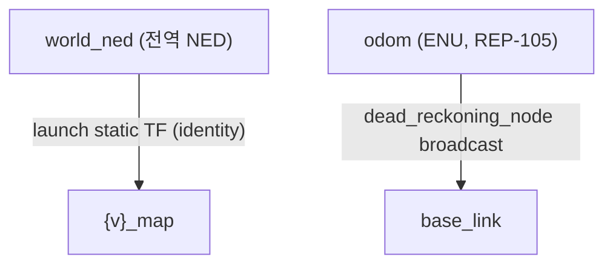

# 좌표계와 TF

이 페이지는 stonefish_slam의 좌표계 정책(`CONVENTIONS.md` §2.0, P4d 결정)을 설명한다. 전역 출력은 모두 `world_ned`(NED)로 통일하고, 로컬 TF 체인(`odom`→`base_link`)은 REP-105의 ENU를 유지하며, 두 경계 사이의 TF는 회전 없는 identity로 둔다.

## 정책 요약

| 구분 | frame | 컨벤션 | 적용 대상 |
|-----|-------|--------|----------|
| 전역 frame_id | `world_ned` | NED | SLAM 출력 전부(pose, odom, traj, map 등) |
| 로컬 TF 체인 | `odom`→`base_link` | ENU(REP-105) | `dead_reckoning_node` |
| 경계 변환 | — | identity(회전 없음) | NED 전역 ↔ ENU 로컬 |

## 전역 frame_id = `world_ned` (NED)

SLAM 노드가 발행하는 모든 토픽의 `frame_id`는 `world_ned`로 통일되어 있다(`CONVENTIONS.md` §2.0, P4d). 이 문자열은 `slam.py`의 각 발행 메서드(pose/odom/constraint/traj/cloud)에 `"world_ned"`로 직접 하드코딩되어 있다.

통일의 근거는 sim 측에 있다. Stonefish sim이 전역 좌표를 NED로 발행하므로, SLAM 출력을 동일한 NED 전역으로 맞춰야 sim의 ground truth(`/{v}/odometry`, RELIABLE QoS, `world_ned` 기준)와 일관되게 비교·정렬된다.

이는 P4d에서 정정된 결정이다. 이전 코드는 일부 출력에 ENU 기준의 `"map"` frame을 혼용하고 있었고, P4d에서 이 혼용을 제거하여 `frame_id`를 `world_ned` 한 가지로 통일했다(v0.4.0 변경: `frame_id world_ned` 통일 8+1곳).

!!! warning "REP-103/REP-105 의도적 비순응"
    ROS 표준 REP-103은 전역 frame을 ENU(`x` 동쪽, `z` 위)로, REP-105는 `map`/`odom`/`base_link` 명명을 권장한다. stonefish_slam의 전역 `world_ned`(NED, `z` 아래)는 이 권장을 **의도적으로 따르지 않는다**. 이유는 sim이 NED 전역을 발행하기 때문이며, sim과의 정합이 ROS 표준 순응보다 우선한다. 표준을 기대하고 외부 도구나 노드를 연결할 때는 이 비순응을 전제로 frame을 다루어야 한다.

## 로컬 TF = ENU (REP-105)

`dead_reckoning_node`가 발행하는 로컬 TF `odom`→`base_link`는 REP-105의 ENU 컨벤션을 유지한다(`CONVENTIONS.md` §2.0). dead reckoning 출력 토픽 `/dead_reck/odom` 역시 `odom` frame(ENU) 기준이다.

`dead_reckoning.py`가 직접 브로드캐스트하는 TF는 `odom`→`base_link` 하나뿐이다(`dead_reckoning.py:318-319`). 전역 `world_ned`와 로컬 체인을 잇는 변환은 launch의 static TF(`world_ned`→`{v}_map`, identity)로 별도 발행된다. 즉 전역 측은 NED, 로컬 측은 ENU로 두 컨벤션이 공존한다.

## TF는 identity (회전 없음)

NED 전역과 ENU 로컬의 경계에서 TF는 identity로 둔다. 두 좌표계 사이에 실제 회전 변환을 적용하지 않고, `frame_id` 이름만 정합시킨다(`CONVENTIONS.md` §2.0). 경계에 회전이 없으므로 frame 이름 표기만 일치하면 체인이 연결된다.

!!! note "왜 회전을 넣지 않는가"
    NED↔ENU는 본래 좌표축 회전을 수반하는 변환이지만, 이 프로젝트는 경계 TF를 identity로 두고 `frame_id` 명명만 맞추는 정책을 택했다. 따라서 TF 트리 상의 변환에서 좌표값이 회전되지 않으며, 좌표계 해석의 차이는 frame 이름으로만 구분된다.

## TF 체인

전역 `world_ned`에서 차량별(`{v}`) frame으로 가는 변환은 launch의 static TF가, 로컬 `odom`→`base_link`는 `dead_reckoning_node`가 각각 발행한다.

## RViz 설정

RViz에서 Fixed Frame은 `world_ned`로 설정한다. 이 frame을 기준으로 pose(공분산 ellipsoid), constraint(loop closure 빨강 line), traj(초록), octomap(청록), `map_2d_image`가 표시된다.

## 관련 하드코딩 상수

frame 문자열이 노드 코드에 직접 정의되어 있다(`CONVENTIONS.md` §2.0).

| 상수 | 값 | 위치 |
|-----|-----|------|
| 전역 frame | `"world_ned"` | `slam.py`의 발행 메서드(예: `:826`, `:893`, `:961`, `:1011`) |
| 로컬 odom frame | `"odom"` | `dead_reckoning.py:299`, `:318` |
| 로컬 body frame | `"base_link"` | `dead_reckoning.py:305`, `:319` |
