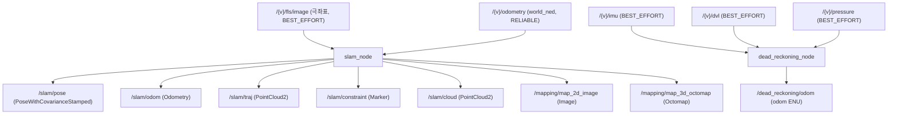

# 노드와 토픽

이 페이지는 `stonefish_slam`이 제공하는 6개의 ROS2 노드와 이들이 주고받는 구독·발행 토픽을 정리한다. 각 노드의 진입 파일·역할·launch·구독 토픽, 그리고 센서 입력 토픽(타입·QoS·frame)과 SLAM 출력 토픽(타입·`frame_id`)을 다룬다.

## 노드 개요

`nodes/` 디렉터리의 진입점은 `~10줄`짜리 얇은 wrapper이며, 실제 로직은 `core/`(ROS-independent)에 있다. 6개 노드는 다음과 같다.

| 노드 | 파일 | 역할 | launch | 구독 |
|------|------|------|--------|------|
| `slam_node` | `core/slam.py:35` (`SLAMNode`) | 통합 SLAM | `slam.launch.py` / `mapping.launch.py` / `localization.launch.py` | `/{v}/fls/image`, `/{v}/odometry` |
| `dead_reckoning_node` | `core/dead_reckoning.py:23` (`DeadReckoningNode`) | DVL/IMU 위치추정 | `dead_reckoning.launch.py` | `/{v}/dvl`, `/{v}/imu`, `/{v}/pressure` |
| `mapping_2d_standalone` | `nodes/mapping_2d_standalone_node.py` | 2D 매핑 전용 | `mapping_2d_standalone.launch.py` | `/{v}/fls/image`, `/{v}/odometry` |
| `mapping_3d_standalone` | `nodes/mapping_3d_standalone_node.py` | 3D 매핑 전용 | `mapping_3d_standalone.launch.py` | `/{v}/fls/image`, `/{v}/odometry` |
| `feature_extraction_node` | `nodes/feature_extraction_node.py` (P4 신규) | CFAR 피처추출 → 점군 | `feature_extraction_standalone.launch.py` | `/{v}/fls/image` |
| `fft_localization_node` | `nodes/fft_localization_node.py` (P4 신규) | FFT 변환 추정 | `fft_localization_standalone.launch.py` | `/{v}/fls/image` |

!!! note "`{v}`는 vehicle_name"
    토픽 경로의 `{v}`는 `vehicle_name` 파라미터로 치환된다. 기본값은 `'bluerov2'`(`sonar.yaml`)이며, launch에서 `vehicle_name:=x500` 처럼 오버라이드할 수 있다.

`feature_extraction_node`와 `fft_localization_node`는 P4에서 신규 추가된 노드로, 통합 `slam_node` 내부에서 동작하던 피처추출·FFT 위치추정 단계를 독립 실행할 수 있게 분리한 것이다.

## 구독 토픽 (센서 입력)

`slam_node`는 소나 이미지와 ground truth odometry를 `ApproximateTimeSynchronizer`로 시간 동기화하여 받는다. `dead_reckoning_node`는 DVL/IMU/Pressure를 별도로 받는다.

| 토픽 | 타입 | QoS | frame / 비고 |
|------|------|-----|--------------|
| `/{v}/fls/image` | `sensor_msgs/Image` | `BEST_EFFORT` | 극좌표(polar) 소나 이미지 |
| `/{v}/odometry` | `nav_msgs/Odometry` | `RELIABLE` | `world_ned` ground truth |
| `/{v}/imu` | `sensor_msgs/Imu` | `BEST_EFFORT` | gyro, accel |
| `/{v}/dvl` | `stonefish_msgs/DVL` | `BEST_EFFORT` | body FRD 속도 |
| `/{v}/pressure` | `sensor_msgs/FluidPressure` | `BEST_EFFORT` | 압력(Pa) → 깊이 |

소나 입력의 QoS `BEST_EFFORT`는 `slam.py:436-437`에 하드코딩되어 있다.

!!! warning "소나 이미지는 극좌표"
    `/{v}/fls/image`는 `num_beams=512`(width) × `num_bins=500`(height)의 극좌표 이미지다(`sonar.yaml`). 매핑·피처추출 단계에서 cartesian으로 변환된다. QoS가 `BEST_EFFORT`이므로 발행 측 QoS도 일치해야 메시지가 수신된다.

## 발행 토픽 (SLAM 출력)

P4d에서 SLAM 출력 토픽의 `frame_id`는 전부 `world_ned`로 통일되었다(이전 `"map"` ENU 혼용을 정정). 전역 frame 문자열 `'world_ned'`는 `slam.py`의 각 발행부에 하드코딩되어 있다(예: `slam.py:893`의 pose `header.frame_id`).

| 토픽 | 타입 | 발행 시점 | frame_id |
|------|------|-----------|----------|
| `/stonefish_slam/slam/pose` | `geometry_msgs/PoseWithCovarianceStamped` | keyframe마다 | `world_ned` |
| `/stonefish_slam/slam/odom` | `nav_msgs/Odometry` | 매 frame | `world_ned` |
| `/stonefish_slam/slam/traj` | `sensor_msgs/PointCloud2` | 궤적 | `world_ned` |
| `/stonefish_slam/slam/constraint` | `visualization_msgs/Marker` | loop closure | `world_ned` |
| `/stonefish_slam/slam/cloud` | `sensor_msgs/PointCloud2` | - | `world_ned` |
| `/stonefish_slam/mapping/map_2d_image` | `sensor_msgs/Image` | - | `world_ned` |
| `/stonefish_slam/mapping/map_3d_octomap` | `octomap_msgs/Octomap` | - | `world_ned` |

standalone·dead_reckoning 노드의 발행 토픽은 다음과 같다.

| 토픽 | 타입 | frame_id / 비고 |
|------|------|-----------------|
| `/feature_extraction/points` | `sensor_msgs/PointCloud2` | feature_extraction_node |
| `/fft_localization/transform` | - | fft_localization_node |
| `/dead_reckoning/odom` | `nav_msgs/Odometry` | `odom` (ENU) |
| `/dead_reckoning/traj` | - | dead_reckoning_node |

!!! note "전역 NED, 로컬 ENU"
    SLAM 출력은 전역 `world_ned`(NED)로 통일되지만, `dead_reckoning`의 `odom→base_link` TF 체인은 REP-105 ENU를 유지한다(`CONVENTIONS §2.0`). NED 전역과 ENU 로컬의 경계에서 TF는 identity이며 회전이 없다 — `frame_id` 이름만 정합시킨다.

## 토픽 그래프

`slam_node`를 중심으로 한 센서 입력 → SLAM → 출력 흐름이다.

독립 노드(`feature_extraction_node`, `fft_localization_node`, `mapping_2d/3d_standalone`)는 위 흐름의 일부 단계만 떼어내 실행하며, 동일한 `/{v}/fls/image`(및 매핑은 `/{v}/odometry`)를 구독한다.

## 관련 문서

- 좌표계·TF 정책과 알고리즘 세부는 별도 페이지를 참고한다.
- 파라미터별 의미와 기본값은 설정 레퍼런스를 참고한다.
