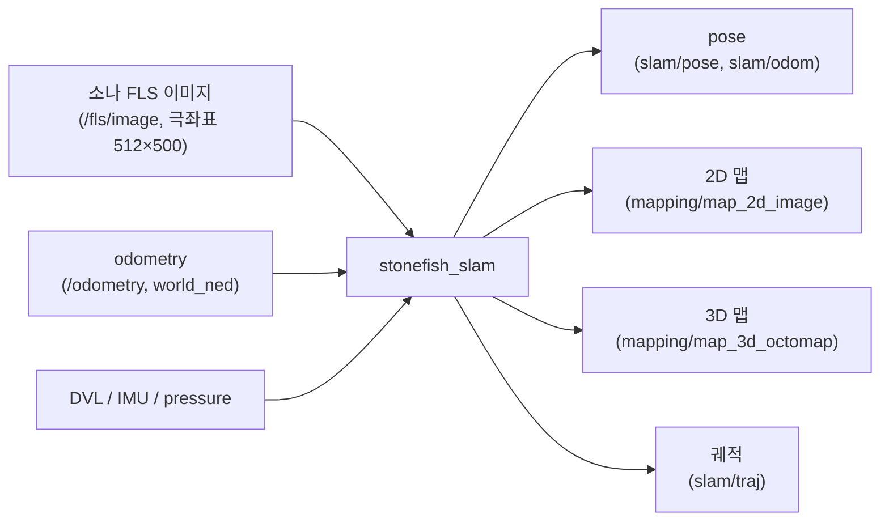
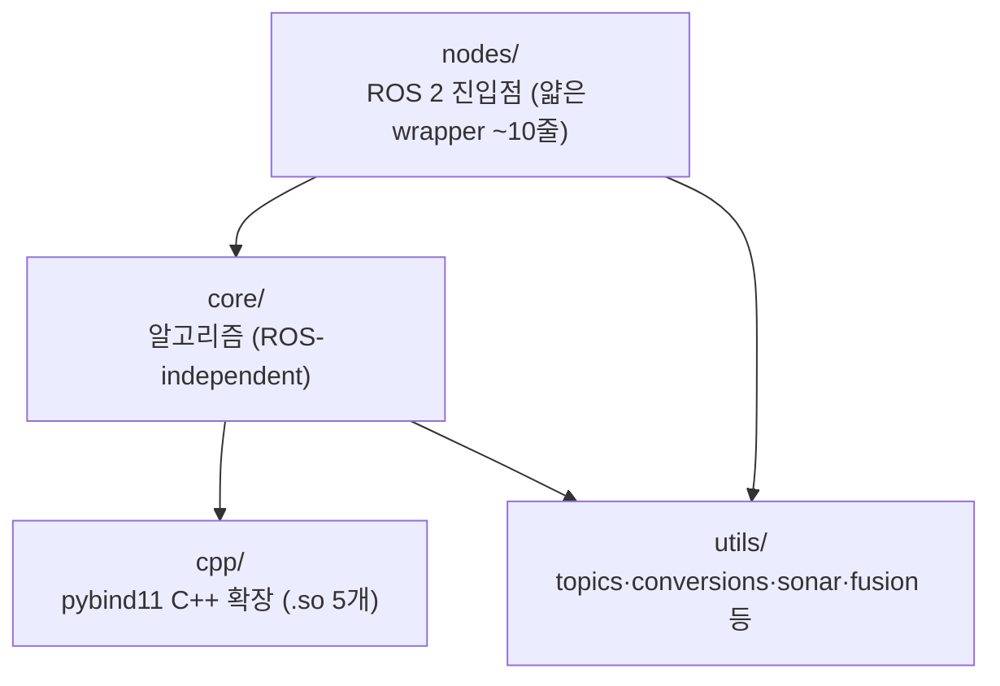

# 개요와 빠른 시작

이 페이지는 `stonefish_slam`을 처음 접하는 사용자를 위해 SLAM 시스템이 무엇을 입력받아 무엇을 만들어 내는지, 코드가 어떤 계층으로 구성되는지, 그리고 가장 빠르게 한 번 돌려 보는 방법을 한눈에 정리한다.

## stonefish_slam이란

`stonefish_slam`은 수중 로봇의 전방 주사 소나(FLS, Forward-Looking Sonar) 이미지와 관성/속도/압력 센서를 입력으로 받아 로봇의 자세(pose)를 추정하고 2D·3D 맵을 만드는 ROS 2 패키지다. 버전은 `0.4.0`, 라이선스는 GPL-3.0이며, C++ pybind11 확장을 포함하기 때문에 `setup.py` 대신 `ament_cmake`로 빌드한다.

## 입력과 출력

SLAM 파이프라인의 큰 그림은 "여러 센서 입력 → GTSAM 팩터 그래프 최적화 → 자세와 맵 출력"이다.



### 입력 토픽

| 토픽 | 메시지 타입 | QoS | 비고 |
|---|---|---|---|
| `/{v}/fls/image` | `sensor_msgs/Image` | `BEST_EFFORT` | 소나 극좌표 이미지 |
| `/{v}/odometry` | `nav_msgs/Odometry` | `RELIABLE` | `world_ned` ground truth |
| `/{v}/imu` | (sensor_msgs/Imu) | `BEST_EFFORT` | gyro·accel |
| `/{v}/dvl` | `stonefish_msgs/DVL` | `BEST_EFFORT` | body FRD 속도 |
| `/{v}/pressure` | `sensor_msgs/FluidPressure` | `BEST_EFFORT` | 압력 → 깊이 |

여기서 `{v}`는 차량 이름으로, 기본값은 `bluerov2`다.

### 출력 토픽

발행되는 모든 토픽의 `frame_id`는 `world_ned`로 통일되어 있다(P4d에서 이전 `map` ENU 혼용을 정정).

| 토픽 | 메시지 타입 | 발행 시점 |
|---|---|---|
| `/stonefish_slam/slam/pose` | `PoseWithCovarianceStamped` | keyframe마다 |
| `/slam/odom` | `Odometry` | 매 frame |
| `/slam/traj` | `PointCloud2` | 궤적 |
| `/mapping/map_2d_image` | `Image` | 2D 점유 그리드 |
| `/mapping/map_3d_octomap` | `Octomap` | 3D OctoMap |
| `/slam/constraint` | `Marker` | loop closure |
| `/slam/cloud` | `PointCloud2` | 점군 |

## 4계층 코드 구조

소스 트리는 알고리즘과 ROS 진입점, C++ 확장, 공용 유틸리티를 명확히 분리한 4계층으로 되어 있다.



| 계층 | 역할 | 대표 모듈 |
|---|---|---|
| `core/` | ROS에 독립적인 알고리즘 본체 | `slam.py`(통합), `factor_graph.py`(GTSAM), `localization.py`(ICP), `mapping_2d.py`·`mapping_3d.py`, `feature_extraction.py`(CFAR), `dead_reckoning.py` |
| `nodes/` | ROS 2 진입점. `core/`를 감싸는 얇은 wrapper | `slam_node.py`, `dead_reckoning_node.py`, `mapping_2d/3d_standalone_node.py` 등 |
| `cpp/` | pybind11 C++ 확장 5개(`.so`) | `cfar.cpp`, `dda_traversal.cpp`, `octree_mapping.cpp`, `ray_processor.cpp`, `pcl.cpp` |
| `utils/` | 토픽·변환·시각화 공용 함수 | `topics.py`, `conversions.py`, `visualization.py`, `sonar.py`, `fusion.py`, `profiler.py`, `io.py` |

!!! note "C++ 확장은 선택"
    `cpp/`의 확장은 빌드되지 않은 환경에서도 동작하도록 `try/except ImportError`로 감싸여 있으며, 실패 시 순수 Python fallback으로 전환된다(특히 `pcl.py`의 ICP). 따라서 C++ 빌드 없이도 SLAM을 실행할 수 있다.

## 가장 빠른 실행 (3터미널)

시뮬레이터·SLAM·제어기를 각각 다른 터미널에서 launch하면 전체 시스템이 동작한다. 각 터미널에서 먼저 워크스페이스를 source(`source install/setup.bash`)해야 한다.

```bash
# 터미널 A — 시뮬레이터
ros2 launch stonefish_ros2 bluerov2.launch.py
```

```bash
# 터미널 B — SLAM
ros2 launch stonefish_slam slam.launch.py
```

```bash
# 터미널 C — 제어기
ros2 launch stonefish_control control.launch.py
```

!!! tip "RViz 설정"
    RViz에서는 Fixed Frame을 `world_ned`로 설정한다. pose(공분산 타원체), constraint(빨강 line), traj(초록), octomap(청록), `map_2d_image`를 함께 시각화할 수 있다.

!!! warning "gtsam은 pip로 설치"
    `apt`의 `ros-humble-gtsam`은 C++ 라이브러리만 제공하여 Python에서 import할 수 없다. SLAM 노드는 GTSAM의 Python 바인딩이 필요하므로 `pip install gtsam`으로 설치해야 한다. 자세한 빌드 절차는 아래 설치 문서를 참고하라.

## 다음 단계

이 페이지는 큰 그림만 다룬다. 구체적인 설치와 실행 방법은 아래 문서에서 이어진다.

- [설치](installation.md) — ROS·apt·pip 의존성, `colcon build` 절차, `.so` 확인 방법.
- [실행](running.md) — 전체/변형/독립 launch 옵션, launch 인자 오버라이드.
