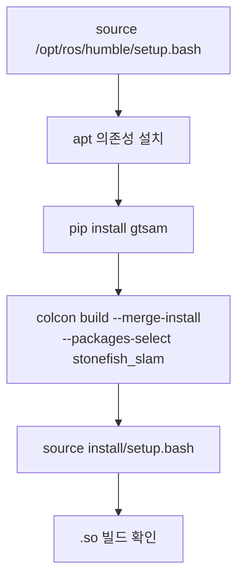

# 설치와 빌드

이 페이지는 `stonefish_slam`의 의존성 설치(apt + pip)부터 `colcon` 빌드, C++ 확장(`.so`) 빌드 확인까지의 절차를 다룬다.

`stonefish_slam`은 버전 0.4.0, GPL-3.0 라이선스의 패키지이며, C++ pybind11 확장을 포함하므로 `setup.py` 없이 `ament_cmake`로 빌드된다. 따라서 Python 패키지뿐 아니라 C++ 툴체인과 네이티브 라이브러리가 함께 필요하다.

!!! tip "두 가지 설치 경로 — 네이티브 또는 Docker"
    설치는 두 방식 중 하나를 택한다. **호스트에 직접 설치**(아래 1~5단계)는 GTSAM·OctoMap·libpointmatcher 등 C++ 의존성과 pybind11 툴체인을 apt/pip으로 직접 맞추는 방식으로, 개발 머신에서 코드를 자주 고칠 때 적합하다. **Docker 이미지 빌드**([Docker로 설치](#docker))는 이 C++ 의존성과 `.so` 확장 빌드를 이미지 안에 모두 묶어 **배포·재현**에 적합하다 — `stonefish_slam`은 `stonefish_sim`과 **같은 이미지**에서 함께 빌드되므로, 시뮬레이터까지 한 번에 갖춰진다. 처음 배포하거나 다른 머신에서 그대로 돌리려면 Docker 경로를 권장한다.

## 사전 조건

ROS 2 Humble 환경을 먼저 source 한다.

```bash
source /opt/ros/humble/setup.bash
```

## 1. apt 의존성 설치

C++ 확장 빌드에 필요한 시스템 라이브러리를 apt로 설치한다. 핵심 항목은 GTSAM(C++), libpointmatcher, OctoMap, pybind11, Eigen3이다.

```bash
sudo apt install \
    ros-humble-gtsam \
    libpointmatcher-dev \
    ros-humble-octomap \
    pybind11-dev \
    libeigen3-dev
```

각 패키지가 빌드의 어느 부분에 쓰이는지는 다음과 같다.

| apt 패키지 | 용도 | 비고 |
|-----------|------|------|
| `ros-humble-gtsam` | GTSAM C++ 라이브러리(factor graph 최적화) | C++만 제공 — Python import 불가 (아래 warning 참조) |
| `libpointmatcher-dev` | C++ ICP 스캔매칭(`pcl.cpp`의 libpointmatcher 래퍼) | 선택 의존성 — 미설치 시 Python ICP fallback |
| `ros-humble-octomap` | 3D OctoMap 확률 매핑(`octree_mapping.cpp`) | C++ 백엔드 |
| `pybind11-dev` | C++↔Python 바인딩(5개 `.so` 모듈) | C++17 필요 |
| `libeigen3-dev` | Eigen3 선형대수 | C++ 확장 공통 |

## 2. pip로 GTSAM 설치 (필수)

!!! warning "apt `ros-humble-gtsam`만으로는 Python에서 GTSAM을 import할 수 없다"
    `apt`로 설치하는 `ros-humble-gtsam`은 **C++ 라이브러리만** 제공하므로, factor graph를 다루는 Python 코드에서 `import gtsam`이 실패한다. 반드시 다음 명령으로 Python 바인딩이 포함된 `gtsam`을 추가 설치해야 한다.

```bash
pip install gtsam
```

GTSAM은 `factor_graph.py`의 GTSAM 그래프 구성과 ISAM2 최적화에 직접 사용된다(`add_prior_factor`, `add_odometry_factor`, `add_icp_factor`, robust Cauchy noise model 등). Python 측에서 import가 되지 않으면 SLAM 노드가 동작하지 않는다.

그 외 Python 의존성은 `numpy`, `scipy`, `opencv-python`, `yaml`, `scikit-learn`, `shapely`, `matplotlib`이다.

## 3. colcon 빌드

`stonefish_slam` 패키지만 선택해 `--merge-install`로 빌드한다.

```bash
colcon build --merge-install --packages-select stonefish_slam
source install/setup.bash
```

!!! note "빌드 후 source는 필수"
    빌드한 패키지를 실행하려면 `install/setup.bash`를 source 해야 한다. ROS 2 setup과 패키지 setup을 모두 source한 셸에서 노드를 실행한다.

빌드 흐름은 다음과 같다.



## Docker로 설치 {#docker}

위의 apt + pip + colcon을 호스트에 직접 하는 대신, **Docker 이미지 하나로 ROS2·Stonefish 라이브러리·`stonefish_sim`·`stonefish_slam`을 모두 빌드**할 수 있다. SLAM의 까다로운 C++ 의존성(GTSAM·OctoMap·libpointmatcher·pybind11)과 5개 `.so` 확장 빌드가 이미지 안에서 끝나므로, 머신마다 의존성을 맞출 필요가 없어 **배포·재현에 적합**하다.

!!! note "sim과 같은 이미지에서 함께 빌드된다"
    환경 자산(Dockerfile·`docker-compose.yml`·`entrypoint.sh`·`stonefish.repos`·`.env.example`)은 **시뮬레이터 워크스페이스의 `.omp/env/`에 정본**으로 관리된다. `stonefish.repos`(vcstool)가 `stonefish`(C++ 코어)·`stonefish_sim`·`stonefish_slam` 세 repo를 한 이미지에 함께 가져와 빌드하므로, SLAM만 따로 빌드하는 Dockerfile은 없다. 시뮬레이터 워크스페이스의 `.omp/env/`에서 빌드하면 SLAM이 시뮬레이터와 같은 컨테이너에 포함된다. 빌드 절차(이미지 구조 `runtime`/`dev`, `xhost`·`.env`·`docker compose build`/`up`)의 상세는 **`stonefish_sim` 문서의 [Docker로 설치]**를 참조한다.

### SLAM 의존성은 이미지에 포함된다

`.omp/env/`의 Dockerfile은 SLAM 빌드에 필요한, `rosdep`가 자동으로 잡지 못하는 의존성을 명시 설치한다. 호스트 네이티브 설치에서 직접 깔아야 했던 항목들이 이미지 빌드 시점에 이미 들어가므로, 컨테이너 안에서는 추가 설치가 필요 없다.

| 의존성 | 이미지에서의 처리 | 네이티브 설치 대비 |
|--------|------------------|--------------------|
| OctoMap | builder `liboctomap-dev` + runtime `liboctomap1.9 ros-humble-octomap-msgs` | `sudo apt install ros-humble-octomap` 불필요 |
| pybind11 | builder `pybind11-dev` | `sudo apt install pybind11-dev` 불필요 |
| PCL | runtime `ros-humble-pcl-conversions ros-humble-pcl-msgs` | `rosdep`가 `pcl` 키를 못 잡아 `--skip-keys`로 우회 |
| 5개 `.so` 확장 | colcon overlay 빌드 시 함께 컴파일 | 컨테이너 안에 빌드 완료 상태 |

!!! warning "GTSAM Python 바인딩은 이미지 정책에 따라 확인"
    호스트 네이티브 설치에서는 `apt ros-humble-gtsam`(C++만) 외에 `pip install gtsam`(Python 바인딩)이 별도로 필요하다. 컨테이너 안에서 `import gtsam`이 실패하면(factor graph 노드가 동작하지 않음) 컨테이너 안에서 `pip install gtsam`을 추가한다. libpointmatcher는 `QUIET` 선택 의존성이라 이미지에 없으면 빌드는 통과하고 ICP가 순수 Python fallback으로 동작한다(아래 "선택 의존성과 Python fallback" 참조).

### 컨테이너 안에서 실행

이미지를 빌드·기동한 뒤(절차는 `stonefish_sim` 문서 참조) 컨테이너에 접속해 SLAM을 실행한다. 워크스페이스 루트는 `/workspace`이고 환경은 entrypoint가 이미 source한다.

```bash
docker exec -it stonefish_run bash
# 컨테이너 안 — 시뮬레이터와 SLAM이 같은 환경에 있음
ros2 launch stonefish_slam slam.launch.py
```

## 4. C++ `.so` 빌드 확인

빌드가 성공하면 5개의 pybind11 C++ 확장 모듈이 `.so`로 설치된다. `CMakeLists.txt:120-339`에 정의된 모듈은 `cfar`, `dda_traversal`, `octree_mapping`, `ray_processor`, `pcl_module`이며, Python 버전을 동적으로 감지(`CMakeLists.txt:115-118`)해 해당 dist-packages 경로에 설치된다.

설치된 `.so`를 다음과 같이 확인한다(Python 3.10 기준).

```bash
ls install/local/lib/python3.10/dist-packages/stonefish_slam/*.so
```

| C++ 모듈 | 소스 | 역할 |
|----------|------|------|
| `cfar` | `cfar.cpp` | CFAR 피처추출(CA/SOCA/GOCA/OS) |
| `dda_traversal` | `dda_traversal.cpp` | DDA ray traversal(free space) |
| `octree_mapping` | `octree_mapping.cpp` | OctoMap 래퍼 |
| `ray_processor` | `ray_processor.cpp` | 소나 ray 처리(multi-hit, intensity 가중) |
| `pcl_module` | `pcl.cpp` | libpointmatcher ICP 래퍼 |

## 5. 선택 의존성과 Python fallback

일부 C++ 의존성은 선택 사항이며, 미설치 또는 미빌드 시 순수 Python 구현으로 대체된다. `cpp/__init__.py`는 각 확장을 `try/except ImportError`로 감싸 import를 시도하고, 빠진 모듈을 모아 import 끝에 한 번 경고를 남긴다(silent pass 금지). C++ 모듈이 없으면 Python fallback 경로로 동작한다.

대표적으로 `libpointmatcher`(또는 `pcl_module` `.so`)가 없으면 ICP가 `pcl.py`의 순수 Python 구현(numpy/scipy 기반 Kabsch+SVD)으로 대체된다.

!!! tip "선택 의존성 미설치 시 동작"
    `libpointmatcher`와 PCL은 CMake에서 `QUIET` 선택 의존성으로 처리된다. 설치되어 있지 않거나 해당 `.so`가 빌드되지 않은 경우, 빌드 중 또는 import 시 **WARNING**이 출력되고 순수 Python fallback이 사용된다. 빌드 자체는 실패하지 않는다.

!!! warning "C++ 변경 시 fallback 동기화"
    C++ 확장을 수정하면 대응하는 Python fallback도 함께 동기화해야 한다(`CONVENTIONS §2.9`). C++ 경계의 일관성이 깨지면 C++ 경로와 Python 경로의 결과가 달라질 수 있다.
