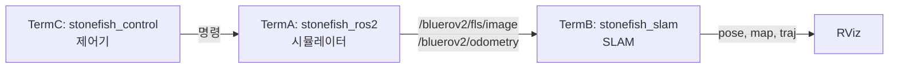

# SLAM 실행

이 페이지는 `stonefish_slam`을 실행하는 방법을 다룬다. 3터미널 전체 SLAM 구성, localization/mapping 모드 변형과 주요 launch 인자, 6종 독립 노드의 standalone launch 커맨드, RViz 설정, 그리고 pytest 테스트 실행까지 순서대로 안내한다.

## 사전 조건

빌드가 완료되어 있어야 한다. 빌드 절차는 [빌드](./installation.md)를 참고한다. 실행 전 매 터미널에서 워크스페이스 환경을 source 한다.

```bash
source /opt/ros/humble/setup.bash
source install/setup.bash
```

!!! note "gtsam Python import"
    `apt`로 설치한 `ros-humble-gtsam`은 C++ 라이브러리만 제공하므로 Python에서 `import gtsam`이 되지 않는다. `pip install gtsam`으로 Python 패키지를 설치해야 한다(분석 사실 §1 의존성).

## 전체 SLAM (3터미널)

전체 시스템은 시뮬레이터, SLAM, 제어기 3개를 별도 터미널에서 실행한다(분석 사실 §5 실행).



각 터미널에서 다음을 실행한다.

```bash
# Terminal A — 시뮬레이터
ros2 launch stonefish_ros2 bluerov2.launch.py
```

```bash
# Terminal B — SLAM
ros2 launch stonefish_slam slam.launch.py
```

```bash
# Terminal C — 제어기
ros2 launch stonefish_control control.launch.py
```

`slam.launch.py`는 `slam_node`(`core/slam.py:35`)를 띄운다. 이 노드는 `/bluerov2/fls/image`(소나 극좌표 이미지)와 `/bluerov2/odometry`(world_ned ground truth)를 구독하여 통합 SLAM을 수행한다.

## 모드 변형

`slam.launch.py`에 인자를 넘기거나 다른 launch 파일을 사용해 동작을 바꾼다.

### localization / mapping 전용 launch

| launch 파일 | 용도 |
|---|---|
| `slam.launch.py` | 통합 SLAM(localization + mapping) |
| `localization.launch.py` | localization 위주 실행 |
| `mapping.launch.py` | mapping 위주 실행 |

```bash
# localization 전용
ros2 launch stonefish_slam localization.launch.py

# mapping 전용
ros2 launch stonefish_slam mapping.launch.py
```

### launch 인자

`slam.launch.py`에 다음 인자를 `이름:=값` 형식으로 전달한다.

| 인자 | 기본값 | 효과 |
|---|---|---|
| `enable_2d_mapping` | `true` | 2D 점유그리드 매핑 on/off |
| `ssm_enable` | 빈 값(yaml 기본 `false`) | 연속 스캔매칭(SSM) 활성화 |
| `nssm_enable` | 빈 값(yaml 기본 `false`) | 비연속 스캔매칭(NSSM, 루프클로저) 활성화 |
| `vehicle_name` | `bluerov2` | 토픽 네임스페이스 차량 이름 |
| `rviz` | `true` | RViz 동시 실행 여부 |

`enable_2d_mapping`(기본 `true`), `ssm.enable`(기본 `false`), `nssm.enable`(기본 `false`), `vehicle_name`(기본 `bluerov2`) 등은 `slam.py:44-154`의 `declare_parameter`로 선언되어 있으며 launch에서 오버라이드된다. `ssm_enable`·`nssm_enable` launch 인자는 기본이 빈 값이라 명시하지 않으면 yaml 기본값(둘 다 `false`)을 그대로 쓴다.

```bash
# 2D 매핑 끄기
ros2 launch stonefish_slam slam.launch.py enable_2d_mapping:=false

# 연속/비연속 스캔매칭 켜기 (SSM + 루프클로저)
ros2 launch stonefish_slam slam.launch.py ssm_enable:=true nssm_enable:=true

# 다른 차량 네임스페이스
ros2 launch stonefish_slam slam.launch.py vehicle_name:=x500

# RViz 없이 실행
ros2 launch stonefish_slam slam.launch.py rviz:=false
```

!!! tip "스캔매칭 기본 비활성"
    `ssm.enable`과 `nssm.enable`은 기본값이 모두 `false`다(`slam.yaml`). 스캔매칭 기반 보정과 루프클로저를 쓰려면 위처럼 명시적으로 켜야 한다.

!!! warning "vehicle_name 변경 시 토픽"
    `vehicle_name`을 바꾸면 구독 토픽 네임스페이스가 함께 바뀐다(예: `/{v}/fls/image`, `/{v}/odometry`). 시뮬레이터가 발행하는 차량 이름과 일치시키지 않으면 입력 토픽을 받지 못한다(분석 사실 §2 구독 토픽).

## 독립 노드 (standalone)

전체 파이프라인 대신 개별 구성요소만 실행할 수 있다. 6종의 standalone launch가 제공된다(분석 사실 §2 노드, §5 독립).

| standalone launch | 노드 | 구독 | 발행 |
|---|---|---|---|
| `feature_extraction_standalone.launch.py` | `feature_extraction_node` | `fls/image` | `/feature_extraction/points` |
| `fft_localization_standalone.launch.py` | `fft_localization_node` | `fls/image` | `/fft_localization/transform` |
| `mapping_2d_standalone.launch.py` | `mapping_2d_standalone` | `fls/image`, `odometry` | `/mapping/map_2d_image` |
| `mapping_3d_standalone.launch.py` | `mapping_3d_standalone` | `fls/image`, `odometry` | `/mapping/map_3d_octomap` |
| `mapping_combined_standalone.launch.py` | 2D + 3D (namespace 분리) | `fls/image`, `odometry` | 2D + 3D map |
| `dead_reckoning.launch.py` | `dead_reckoning_node` | `/{v}/dvl`, `/{v}/imu`, `/{v}/pressure` | `/dead_reckoning/odom`, `/dead_reckoning/traj` |

```bash
# CFAR 피처 추출만 (소나 이미지 → 점군)
ros2 launch stonefish_slam feature_extraction_standalone.launch.py

# FFT 위치추정만
ros2 launch stonefish_slam fft_localization_standalone.launch.py

# 2D 점유그리드 매핑만
ros2 launch stonefish_slam mapping_2d_standalone.launch.py

# 3D OctoMap 매핑만
ros2 launch stonefish_slam mapping_3d_standalone.launch.py

# 2D + 3D 동시 (namespace 분리)
ros2 launch stonefish_slam mapping_combined_standalone.launch.py

# Dead Reckoning (DVL/IMU/Pressure 기반 위치추정)
ros2 launch stonefish_slam dead_reckoning.launch.py
```

`feature_extraction_node`와 `fft_localization_node`는 P4에서 신규 추가된 노드다(분석 사실 §1 패키지 트리). `nodes/` 하위의 진입점은 알고리즘 본체를 감싸는 얇은 wrapper다.

!!! note "dead_reckoning의 좌표계"
    `dead_reckoning_node`의 `/dead_reckoning/odom`은 `odom` 프레임 ENU 체계를 따른다(REP-105 로컬 TF 정책). 반면 통합 SLAM의 출력 토픽은 전부 `world_ned`로 통일되어 있다(분석 사실 §2 TF/좌표계 정책, P4d).

## RViz

RViz의 Fixed Frame은 `world_ned`로 설정한다. SLAM 출력이 전부 `world_ned`(NED 전역)로 통일되어 있기 때문이다(분석 사실 §2, P4d). 주요 표시 항목은 다음과 같다(분석 사실 §5 RViz).

| 표시 항목 | 토픽 | 표현 |
|---|---|---|
| pose | `/stonefish_slam/slam/pose` | 공분산 ellipsoid |
| constraint | `/slam/constraint` | 빨강 line (loop closure) |
| traj | `/slam/traj` | 초록 궤적 |
| octomap | `/mapping/map_3d_octomap` | 청록 |
| map_2d_image | `/mapping/map_2d_image` | 2D 점유그리드 이미지 |

`rviz:=false` 인자를 주지 않으면 launch가 RViz를 함께 띄운다.

## 테스트

테스트는 pytest로 실행한다(분석 사실 §5 테스트). golden 기준은 37 passed다.

```bash
pytest -v stonefish_slam/test/test_*.py
```

재현 가능한 clean environment에서 검증하려면 `env -i`로 환경 변수를 비운 채 실행한다.

```bash
env -i /usr/bin/python3 -m pytest -q stonefish_slam/test/
```

이 구성에서 golden 결과는 37 passed, 0 xfail이다(P4 시작 시점 13 passed + 1 xfail에서 37 passed로 증가, 분석 사실 §6).

테스트 디렉터리에는 일반 `test_*.py` 외에 AST 기반 정적 게이트가 포함되어 있다. `test_wildcard_gate.py`는 wildcard import가 0임을 강제하고, `static_import_gate.py`는 import 규칙을 검사한다(분석 사실 §1 패키지 트리, §5 테스트).

!!! tip "clean env로 검증하는 이유"
    `env -i`는 현재 셸의 오염된 환경 변수를 제거하고 `/usr/bin/python3`로 직접 실행한다. 로컬 환경 차이에 흔들리지 않는 재현 가능한 golden 측정을 얻기 위한 것이다.
