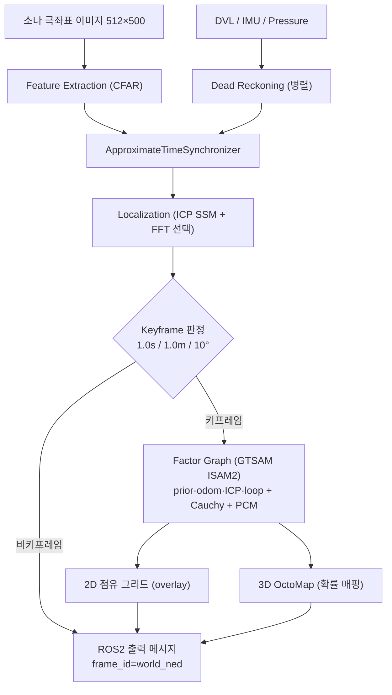

# stonefish_slam

stonefish_slam은 수중 전방주사 소나(FLS) 기반의 ROS2 Humble SLAM 패키지로, CFAR 피처 추출 → ICP 위치 추정 → GTSAM factor graph 최적화 → 2D 점유 그리드·3D OctoMap 매핑으로 이어지는 파이프라인을 제공한다. 이 페이지는 패키지가 무엇인지, 어떤 기술 스택으로 구성되는지, 그리고 이 문서를 어떤 순서로 읽으면 되는지를 안내하는 홈이다.

## 무엇을 하는가

stonefish_slam은 [stonefish_sim](#연동-stonefish_sim)이 발행하는 소나 이미지와 odometry를 입력받아, 수중 환경의 지도를 작성하고 차량의 위치를 추정한다. 핵심 알고리즘은 ROS와 독립적인 `core/` 모듈에 있고, ROS2 진입점은 `nodes/`에 얇은 wrapper로 분리되어 있다.

처리 흐름은 소나 극좌표 이미지(512×500)에서 CFAR로 피처를 뽑아 점군으로 만들고(`feature_extraction.py`), DVL/IMU/pressure 기반 dead reckoning을 병렬로 수행한 뒤(`dead_reckoning.py`), ICP 스캔 매칭(`localization.py`)과 선택적 FFT 위치 추정(`localization_fft.py`)으로 상대 변환을 구한다. 키프레임 단위로 GTSAM ISAM2 factor graph(`factor_graph.py`)에 prior/odometry/ICP/loop closure factor를 추가해 최적화하고, 결과 pose로 2D overlay 지도(`mapping_2d.py`)와 3D OctoMap(`mapping_3d.py`)을 갱신한다.

전역 좌표계는 `world_ned`(NED)로 통일되어 있으며, 이는 sim이 NED 전역을 발행하는 것에 맞춘 정책이다. 로컬 dead reckoning의 `odom→base_link` 체인만 REP-105 ENU를 유지한다.

## SLAM 파이프라인

odometry는 `/bluerov2/odometry`(`nav_msgs/Odometry`, RELIABLE), 소나는 `/bluerov2/fls/image`(`sensor_msgs/Image`, BEST_EFFORT, 극좌표)로 들어온다. 출력은 `/stonefish_slam/slam/pose`, `/slam/odom`, `/slam/traj`, `/mapping/map_2d_image`, `/mapping/map_3d_octomap` 등이며 모두 `world_ned` 좌표계로 발행된다.

## 핵심 기술 스택

| 영역 | 기술 | 역할 |
|------|------|------|
| 그래프 최적화 | GTSAM (ISAM2) | factor graph 증분 최적화, robust Cauchy loss |
| 위치 추정 | libpointmatcher ICP | Point-to-Point 스캔 매칭(C++), 순수 Python fallback |
| 매핑 | OctoMap | 3D 확률 점유 격자(`octomap_msgs`) |
| 피처 추출 | CFAR (`CA`/`SOCA`/`GOCA`/`OS`) | 소나 이미지에서 표적 셀 검출 |
| C++ 가속 | pybind11 확장 5개 | `cfar`, `dda_traversal`, `octree_mapping`, `ray_processor`, `pcl_module` |

C++ 확장은 `CMakeLists.txt:120-339`에서 5개 모듈로 빌드되며 C++17을 사용한다. import는 `try/except ImportError`로 감싸 `CPP_*_AVAILABLE` 플래그를 두고, 확장이 빌드되지 않은 환경에서는 순수 Python fallback(특히 `pcl.py`의 ICP)으로 자동 전환된다.

!!! note "GTSAM 설치 주의"
    `apt`로 설치하는 `ros-humble-gtsam`은 C++ 라이브러리만 제공하여 Python import가 되지 않는다. Python에서 GTSAM을 쓰려면 `pip install gtsam`을 권장한다. 자세한 의존성은 [설치와 빌드](getting-started/installation.md)를 참조하라.

## 연동: stonefish_sim { #연동-stonefish_sim }

stonefish_slam은 단독으로 센서를 구동하지 않는다. 짝을 이루는 stonefish_sim 패키지가 수중 환경을 시뮬레이션하여 소나 이미지(`/bluerov2/fls/image`)와 ground-truth odometry(`/bluerov2/odometry`, `world_ned`)를 발행하고, stonefish_slam이 이를 구독해 SLAM을 수행한다. 따라서 전체 시스템을 실행하려면 sim과 slam을 함께 띄워야 한다(자세한 실행 순서는 [SLAM 실행](getting-started/running.md) 참조).

## 이 문서 읽는 법

목적에 따라 다음 순서로 읽으면 된다.

| 섹션 | 다룰 내용 | 시작 페이지 |
|------|-----------|-------------|
| 시작하기 | 빠른 시작, 의존성 설치·colcon 빌드, sim+slam 실행 | [개요와 빠른 시작](getting-started/index.md) |
| 아키텍처 | 패키지 구조, 노드·토픽·서비스, 좌표계와 TF 정책 | [시스템 구조](architecture/index.md) |
| 방법론·알고리즘 | 파이프라인, CFAR, ICP·FFT, GTSAM factor graph, 매핑 | [SLAM 파이프라인](methodology/index.md) |
| 파라미터 레퍼런스 | 모든 YAML 파라미터의 기본값과 의미 | [개요와 사용법](parameters/index.md) |
| 버전·상태 | 버전 이력, v0.4.0 변경 내역, P4_FLAGS 상태 | [버전·상태](status.md) |

!!! tip "처음 시작한다면"
    먼저 [개요와 빠른 시작](getting-started/index.md)에서 sim과 slam을 함께 실행해 동작을 확인한 뒤, [SLAM 파이프라인](methodology/index.md)으로 전체 알고리즘 흐름을 잡고, 튜닝이 필요할 때 [파라미터 레퍼런스](parameters/index.md)를 펼쳐 보는 순서를 권장한다.

## 버전

현재 버전은 **0.4.0**(2026-06-24)이며, P4 단계에서 알고리즘 정확성을 의도적으로 변경한 minor bump이다. 라이선스는 GPL-3.0, 빌드 시스템은 ament_cmake(pybind11 C++ 확장 때문에 setup.py 없음)이다. 버전 이력과 v0.4.0의 구체적 변경(kalman 노드 제거, octree·DDA·ICP·depth 버그 수정, `world_ned` 통일, robust Cauchy 도입 등)은 [버전·상태](status.md)에서 확인할 수 있다.
