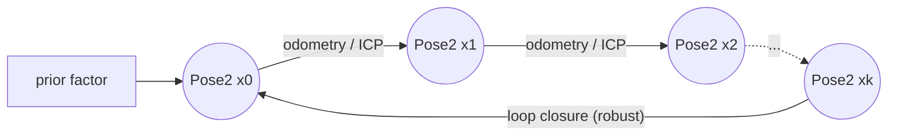
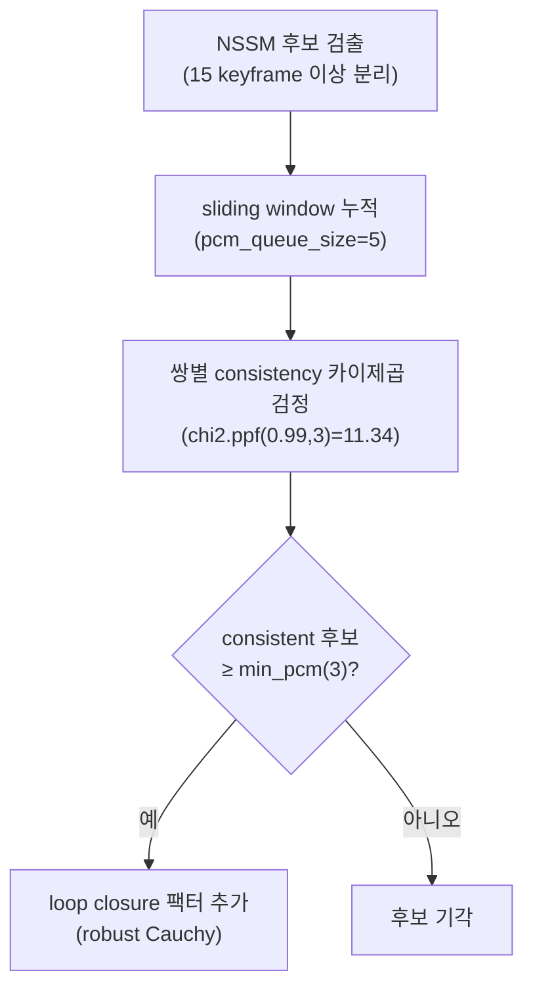

# 팩터 그래프(GTSAM)

이 페이지는 stonefish_slam이 GTSAM 팩터 그래프로 키프레임 포즈를 추정하는 방식 — 변수(`Pose2`), 4종 팩터(prior/odometry/ICP/loop closure), ISAM2 증분 최적화, 노이즈 모델, robust Cauchy 커널, PCM(Pairwise Consistency Maximization) 루프 검증 — 을 설명한다. 구현은 `core/factor_graph.py`와 `core/slam.py`에 있다.

## 그래프 구조 개요

SLAM 백엔드는 키프레임마다 하나의 변수 노드(`Pose2`, 평면 \((x, y, \theta)\))를 추가하고, 그 변수를 이웃 변수와 연결하는 팩터(제약)를 더한다. 변수가 추정 대상이고, 팩터는 측정값과 그 불확실성을 표현한다. 최적화는 ISAM2(`gtsam.ISAM2.update`)로 증분 수행된다.

| 요소 | GTSAM 타입 | 추가 함수 | 근거 |
|-----|-----------|----------|------|
| 변수 | `Pose2` (keyframe) | — | factor_graph.py |
| prior 팩터 | `PriorFactorPose2` | `add_prior_factor` | factor_graph.py |
| odometry 팩터 | `BetweenFactorPose2` | `add_odometry_factor` | factor_graph.py |
| ICP 팩터 | `BetweenFactorPose2` | `add_icp_factor` | factor_graph.py |
| loop closure 팩터 | `BetweenFactorPose2` + `noiseModel.Robust` | `add_icp_factor`(robust) | factor_graph.py |
| 최적화 | `ISAM2.update` | `optimize` | factor_graph.py |

## 변수: Pose2 키프레임

각 변수는 평면 포즈 `Pose2` \((x, y, \theta)\)이며, 키프레임이 생성될 때마다 그래프에 추가된다. 키프레임 생성 조건은 `localization.yaml`에 정의되어 있다(`keyframe_duration` 1.0s, `keyframe_translation` 1.0m, `keyframe_rotation` 0.174533rad = 10°). 자세한 키프레임 결정 파라미터는 [localization-graph.md](../parameters/localization-graph.md)를 참조하라.

## 4종 팩터

### prior 팩터 (PriorFactorPose2)

그래프의 첫 변수를 고정하기 위한 절대 제약이다. `add_prior_factor`가 `PriorFactorPose2`를 추가한다. 노이즈는 `slam_prior_noise`([0.1, 0.1, 0.01], 각각 \(x_m, y_m, \theta_{rad}\))로 ICP와 함께 가장 타이트하다.

### odometry 팩터 (BetweenFactorPose2)

연속한 두 키프레임 사이의 상대 변환을 표현한다. `add_odometry_factor`가 `BetweenFactorPose2`를 추가한다. 노이즈는 `slam_odom_noise`([0.2, 0.2, 0.02])로 prior보다 느슨하다. odometry 팩터는 robust 처리하지 않는다(non-robust).

### ICP 팩터 (BetweenFactorPose2)

스캔 매칭(SSM, Sequential Scan Matching)으로 추정한 상대 변환을 표현한다. `add_icp_factor`가 `BetweenFactorPose2`를 추가하며, 노이즈는 `slam_icp_noise`([0.1, 0.1, 0.01])이다. SSM ICP 팩터는 robust 처리하지 않는다.

### loop closure 팩터 (robust)

오래 떨어진 키프레임 사이를 다시 잇는 루프 클로저 제약이다. NSSM(Non-Sequential Scan Matching)으로 후보를 찾고, `add_icp_factor`에 robust 옵션을 주어 `gtsam.noiseModel.Robust(Cauchy, base)`로 감싼 `BetweenFactorPose2`를 추가한다. **robust 커널은 NSSM 루프 클로저 팩터에만 적용**되며, SSM/odometry 팩터는 non-robust로 둔다.

!!! note "어느 팩터가 robust인가"
    prior · odometry · SSM ICP 팩터는 모두 non-robust(`Diagonal.Sigmas`)다. robust Cauchy 커널은 NSSM 루프 클로저 팩터에만 붙는다. 루프 클로저가 거짓 매칭일 가능성이 가장 크기 때문이다.

## 노이즈 모델 (Diagonal.Sigmas)

세 종류의 비-robust 팩터는 모두 대각 가우시안 노이즈 모델을 쓴다. 구현은 `gtsam.noiseModel.Diagonal.Sigmas(Point3(*noise))` 형태이며 slam.py:114-123에 있다. 시그마 벡터는 \((\sigma_x, \sigma_y, \sigma_\theta)\) 순서로, 앞 두 성분은 미터, 세 번째는 라디안이다.

| 노이즈 모델 | 파라미터 | 기본값 \((\sigma_x, \sigma_y, \sigma_\theta)\) | 적용 팩터 |
|-----------|---------|--------------------------------------------|----------|
| prior | `slam_prior_noise` | `[0.1, 0.1, 0.01]` | `PriorFactorPose2` |
| odometry | `slam_odom_noise` | `[0.2, 0.2, 0.02]` | odometry `BetweenFactorPose2` |
| ICP | `slam_icp_noise` | `[0.1, 0.1, 0.01]` | SSM ICP `BetweenFactorPose2` |

시그마가 작을수록 해당 측정을 더 신뢰한다. prior와 ICP가 가장 타이트하고, odometry가 상대적으로 느슨하다. 파라미터 정의 위치와 변경 영향은 [localization-graph.md](../parameters/localization-graph.md)를 참조하라.

## ISAM2 증분 최적화

새 변수와 팩터를 그래프에 더한 뒤 `gtsam.ISAM2.update`를 호출해 증분 최적화한다. 전체 그래프를 매번 처음부터 다시 푸는 대신, 영향을 받는 부분만 갱신하므로 키프레임이 누적되어도 비용이 완만하게 증가한다.

## Robust Cauchy 커널 (P4c)

루프 클로저 팩터의 잔차를 down-weight하기 위해 Cauchy M-estimator를 사용한다. 표준 가우시안 노이즈 모델 위에 robust 래퍼를 씌운 형태다:

\[
\text{Robust}\big(\text{Cauchy}(c),\ \text{base}\big)
\]

Cauchy 커널의 가중치 함수는 잔차 크기 \(x\)에 대해 다음과 같다:

\[
w(x) = \frac{1}{1 + \left(\dfrac{x}{c}\right)^2}
\]

여기서 \(c\)는 `slam_loop_robust_c`(기본 3.0, factor_graph.py:51의 `robust_loop_c` 기본값과 동일)다. \(c = 3.0\)일 때 잔차가 \(3\sigma\)인 지점에서 가중치는 다음과 같다:

\[
w(3) = \frac{1}{1 + (3/3)^2} = \frac{1}{2} \approx 0.5
\]

즉 \(3\sigma\) 거짓 매칭은 가중치 약 0.5로 절반만 반영된다. 이는 완전 기각(weight 0)이 아니라 down-weight로, 측정을 부드럽게 깎아내는 방식이다.

!!! tip "slam_loop_robust_c 조정"
    `slam_loop_robust_c`(기본 `3.0`)를 키우면 더 큰 잔차까지 신뢰하므로 거짓 루프에 둔감해지고, 줄이면 작은 불일치도 강하게 깎아 보수적이 된다. 이 커널은 NSSM 루프 클로저 팩터에만 적용되므로, SSM/odometry 추정에는 영향이 없다.

!!! warning "robust는 PCM 통과 이후의 안전망"
    Cauchy 커널은 거짓 루프를 그래프에 넣은 뒤 그 영향을 줄이는 부드러운 방어선이다. 거짓 루프를 애초에 거르는 1차 방어선은 아래의 PCM이다. 두 메커니즘은 보완 관계로, robust 커널 하나만으로 큰 outlier 루프를 막을 수 없다.

## PCM: Pairwise Consistency Maximization

NSSM 루프 클로저 후보를 그래프에 넣기 전에, 후보들끼리 서로 기하학적으로 일관되는지 검사해 거짓 루프를 거른다. `core/localization.py`의 NSSM 경로와 `core/factor_graph.py`가 함께 수행한다.

PCM은 최근 루프 클로저 후보를 sliding window에 모아 쌍별 consistency를 측정한다:

- sliding window 크기 = `pcm_queue_size`(5, `factor_graph.yaml`)
- 쌍 consistency 판정 임계값 = 카이제곱 분포 \(\chi^2_{0.99,\,3} = \texttt{chi2.ppf}(0.99,\,3) = 11.34\)
- 수용 조건 = 서로 consistent한 후보가 `min_pcm`(3) 개 이상일 때

즉 window 안에서 카이제곱 검정(자유도 3, 평면 포즈 \((x, y, \theta)\)에 대응)으로 쌍별 일치를 확인하고, 충분히 많은 후보가 상호 일관(≥3)일 때만 루프 클로저를 그래프에 추가한다. 쌍별 Mahalanobis 거리 계산은 v0.4.0에서 `np.inv` 기반 역행렬에서 `solve` 기반으로 변경되어 수치 안정성을 개선했다.

| 파라미터 | 기본값 | 의미 | 설정 파일 |
|---------|-------|------|----------|
| `nssm.min_st_sep` | `15` | 루프 후보로 볼 최소 키프레임 분리 | `factor_graph.yaml` |
| `nssm.source_frames` | `5` | NSSM 매칭 시 통합할 최근 키프레임 수 | `factor_graph.yaml` |
| `pcm_queue_size` | `5` | PCM sliding window 크기 | `factor_graph.yaml` |
| `min_pcm` | `3` | 수용에 필요한 최소 consistent 루프 수 | `factor_graph.yaml` |
| `nssm.max_translation` | `5.0` (m) | NSSM 매칭 허용 최대 병진 | `factor_graph.yaml` |
| `nssm.max_rotation` | `0.5236` (rad, 30°) | NSSM 매칭 허용 최대 회전 | `factor_graph.yaml` |
| `nssm.min_points` | `150` | NSSM 매칭 최소 점 수 | `factor_graph.yaml` |
| `nssm.cov_samples` | `30` | 공분산 샘플 수(`0`=비활성) | `factor_graph.yaml` |

!!! warning "min_pcm와 pcm_queue_size 조정 효과"
    `min_pcm`(기본 `3`)을 키우면 더 많은 상호 일관 후보를 요구해 거짓 루프를 강하게 거르지만 정상 루프도 놓치기 쉽다. `pcm_queue_size`(기본 `5`)를 키우면 더 긴 이력에서 consistency를 보지만 그만큼 판정이 늦어진다. 두 값은 `factor_graph.yaml`에서 함께 조정한다.

## NSSM ↔ 팩터 그래프 흐름 정리

NSSM 스캔 매칭은 15 keyframe 이상 떨어진 과거 키프레임과 현재를 매칭하고, 최근 5개 키프레임을 통합해 strict 검증(5.0m / 30°)을 통과한 상대 변환을 만든다. 이 변환 후보들이 PCM(sliding window 5, \(\chi^2_{0.99,3}=11.34\), ≥3 consistent)을 통과하면, robust Cauchy 커널을 씌운 `BetweenFactorPose2`로 그래프에 추가되고 ISAM2가 증분 최적화한다(localization.py:150-200 + factor_graph.py 분석 기준).

## 관련 페이지

- [localization-graph.md](../parameters/localization-graph.md) — 키프레임·노이즈·NSSM·PCM 파라미터 전체 레퍼런스
