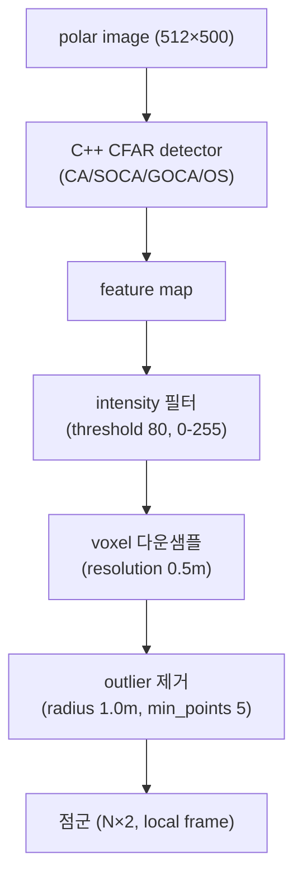

# 피처 추출(CFAR)

이 페이지는 stonefish_slam이 소나 polar 이미지에서 CFAR(Constant False Alarm Rate) 검출로 피처를 뽑아 점군(point cloud)으로 만드는 방법과, 4종 CFAR 변형(CA/SOCA/GOCA/OS)의 차이 및 SOCA가 기본인 이유를 설명한다.

## 개요

소나 이미지에서 "진짜 반사체"를 찾으려면 단순 고정 임계값으로는 부족하다. 배경 잡음(reverberation)의 세기가 거리·환경에 따라 달라지기 때문이다. CFAR은 각 셀(cell) 주변의 배경 통계를 추정해 **오경보율(false alarm rate)을 일정하게 유지**하도록 임계값을 적응적으로 정한다. stonefish_slam은 CFAR 검출을 C++(`cfar.cpp`)로 구현하고 Python wrapper(`cfar.py`)로 4종 알고리즘(CA/SOCA/GOCA/OS)을 노출한다.

CFAR 검출 자체는 `feature_extraction.py`가 호출하며, 그 결과를 강도 필터링·다운샘플·outlier 제거를 거쳐 local frame 점군으로 변환한다.

## CFAR 4종 비교

CFAR은 검사 대상 셀(CUT, Cell Under Test) 주변에 가드셀(guard cell)을 두고, 그 바깥의 훈련셀(training cell)로 배경 잡음을 추정한다. 4종은 **훈련셀 통계를 어떻게 합치느냐**가 다르다.

| 알고리즘 | 명칭 | 임계값 산정 방식 | 특징 |
|---|---|---|---|
| `CA` | Cell Averaging | 좌우 훈련셀 전체 평균 | 균질 배경에서 가장 기본적 |
| `SOCA` | Smallest Of Cell Averaging | 좌우 윈도우 평균 중 **작은 쪽** 사용 | 잡음이 적은 쪽 기준 → robust, 기본값 |
| `GOCA` | Greatest Of Cell Averaging | 좌우 윈도우 평균 중 **큰 쪽** 사용 | 보수적 검출 |
| `OS` | Order Statistic | 훈련셀을 정렬해 `rank`번째 값 사용 | 순위 통계, 이상치에 강함 |

(`cfar.cpp` / `cfar.py`가 CA/SOCA/GOCA/OS를 제공.)

!!! note "SOCA가 기본인 이유"
    `feature.yaml`의 `alg` 기본값은 `'SOCA'`(Smallest Of Cell Averaging)이며 분석 사실에서 robust한 선택으로 추천된다. SOCA는 CUT 양쪽 윈도우의 평균 중 **작은 값**을 배경 추정으로 쓰기 때문에, 한쪽에 강한 반사체나 잡음이 끼어 있어도 그 영향을 덜 받아 검출이 안정적이다.

## 핵심 파라미터의 의미

CFAR 임계값은 아래 세 값으로 결정된다. 전체 파라미터 목록·기본값은 [소나·피처 파라미터](../parameters/sonar-feature.md)를 참조한다.

| 파라미터 | 의미 |
|---|---|
| `Ntc` | 훈련셀(training cell) 수. 배경 잡음 통계를 추정하는 데 쓰는 셀 개수. 기본 `20` |
| `Ngc` | 가드셀(guard cell) 수. CUT 바로 옆을 훈련에서 제외해, 표적 에너지가 배경 추정에 새는 것을 막음. 기본 `10` |
| `Pfa` | 목표 오경보율(probability of false alarm). 낮을수록 임계값이 높아져 검출이 보수적. 기본 `0.01`(1%) |

추가로 `rank`(기본 `10`)는 `OS` 알고리즘에서 정렬된 훈련셀 중 몇 번째 순위 값을 임계값 기준으로 쓸지 정한다. 임계값은 목표 `Pfa`를 만족하도록 root-find(근 찾기)로 산정된다.

!!! tip "Pfa를 낮추면"
    `Pfa`를 낮추면 임계값이 올라가 오경보(가짜 피처)는 줄지만, 약한 진짜 반사체를 놓칠 수 있다. 반대로 높이면 검출은 많아지나 잡음 피처가 늘어 후단의 outlier 제거 부담이 커진다.

## 추출 파이프라인

CFAR 검출 결과는 곧바로 점군이 되지 않는다. 강도 필터 → voxel 다운샘플 → outlier 제거를 차례로 거쳐 정제된다(`feature_extraction.py`).



각 단계의 의미는 다음과 같다.

| 단계 | 동작 | 관련 파라미터 |
|---|---|---|
| C++ CFAR detector | polar 이미지에서 CFAR로 표적 셀 검출 | `alg`, `Ntc`, `Ngc`, `Pfa`, `rank` |
| intensity 필터 | 최소 강도 미만 피처 제거(0-255 스케일) | `filter.threshold`(`80`) |
| voxel 다운샘플 | 일정 격자 크기로 점 밀도 균일화 | `resolution`(`0.5m`) |
| outlier 제거 | 반경 내 이웃이 적은 고립점 제거 | `radius`(`1.0m`), `min_points`(`5`) |

최종 출력은 local frame 기준의 `N×2` 점군이며, 이후 Localization(ICP 스캔매칭)과 Mapping의 입력이 된다.

!!! note "skip 파라미터"
    `feature.yaml`의 `filter.skip`(기본 `5`)은 매 N번째 프레임만 처리하도록 하는 다운레이트 설정으로, CFAR 처리 부하를 조절한다.

## 독립 실행 노드

P4에서 추가된 `feature_extraction_node`는 CFAR 피처 추출만 독립적으로 수행하는 노드다(`nodes/feature_extraction_node.py`). `feature_extraction_standalone.launch.py`로 실행하며 `/{vehicle}/fls/image`를 구독해 `/feature_extraction/points`로 점군을 발행한다.

```bash
ros2 launch stonefish_slam feature_extraction_standalone.launch.py
```

시각화 옵션(`feature.yaml`)으로 `coordinates`(`'cartesian'`), `radius`(`2.0`), `color`(`'green'`)가 있다.

## 관련 페이지

- [소나·피처 파라미터](../parameters/sonar-feature.md) — CFAR·필터·시각화 파라미터 전체 레퍼런스
