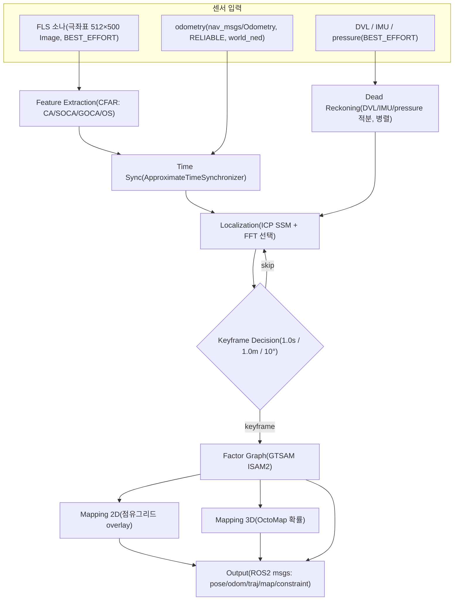

# SLAM 파이프라인

이 페이지는 `stonefish_slam`의 전체 SLAM 파이프라인 — 소나/관성 센서 입력부터 feature 추출, dead reckoning, time sync, localization, keyframe 결정, factor graph 최적화, mapping, ROS2 출력까지 — 를 하나의 다이어그램으로 조망하고, 각 단계의 한 줄 요약과 상세 페이지 링크를 제공한다.

## 전체 파이프라인

전체 흐름은 `slam.py`의 통합 노드 `SLAMNode`(core/slam.py:35)를 중심으로 구성된다. 소나는 극좌표 512×500 이미지를 BEST_EFFORT QoS로, odometry는 RELIABLE QoS로 받으며, DVL/IMU/pressure는 dead reckoning 경로에서 병렬로 처리된다. 두 경로는 `ApproximateTimeSynchronizer`로 시간 정합된 뒤 localization → keyframe decision → factor graph → mapping 순으로 이어진다.

## 단계별 요약

각 단계의 핵심 동작과 상세 페이지는 아래와 같다. 상세 알고리즘·파라미터는 링크된 페이지에서 다룬다.

| 단계 | 한 줄 요약 | 상세 |
|------|-----------|------|
| 센서 입력 | 소나 극좌표 512×500 이미지 + DVL/IMU/pressure를 별도 QoS로 구독 (slam.py:436-437 BEST_EFFORT) | — |
| Feature Extraction | CFAR로 소나 강한 echo를 검출해 local frame 점군(N×2)으로 변환 | [feature-cfar](feature-cfar.md) |
| Dead Reckoning | DVL/IMU/pressure를 적분해 odom 위치를 병렬 추정, time sync 입력 제공 | [factor-graph](factor-graph.md) |
| Time Sync | `ApproximateTimeSynchronizer`로 feature와 odometry를 시간 정합 | — |
| Localization | 최근 keyframe 점군과 ICP(SSM) 스캔매칭, FFT 위치추정은 선택 | [localization](localization.md) |
| Keyframe Decision | `keyframe_duration`(1.0s) / `keyframe_translation`(1.0m) / `keyframe_rotation`(10°) 게이트 | [localization](localization.md) |
| Factor Graph | GTSAM ISAM2에 prior/odom/ICP/loop factor 추가, robust Cauchy + PCM 루프클로저 | [factor-graph](factor-graph.md) |
| Mapping 2D | polar→cartesian overlay 점유그리드 (`0.1` m/px, 4000×4000) | [mapping](mapping.md) |
| Mapping 3D | OctoMap 확률 그리드, DDA ray traversal + 3가지 업데이트법 | [mapping](mapping.md) |
| Output | `world_ned` frame으로 pose/odom/traj/map/constraint ROS2 토픽 발행 | — |

### 센서 입력

`/{v}/fls/image`(극좌표 sensor_msgs/Image)와 `/{v}/odometry`(world_ned ground truth)를 구독하고, DVL/IMU/pressure는 dead reckoning 경로에서 병렬로 받는다. 소나·관성 토픽은 BEST_EFFORT, odometry는 RELIABLE QoS다.

### Feature Extraction (CFAR)

극좌표 이미지를 C++ CFAR(CA/SOCA/GOCA/OS) 모듈로 처리해 강한 echo를 검출하고, intensity 필터(`threshold` 80) → voxel 다운샘플(`resolution` 0.5m) → outlier 제거(`radius` 1.0m, `min_points` 5)를 거쳐 N×2 local frame 점군을 만든다. 기본 알고리즘은 SOCA다. 자세한 내용은 [feature-cfar](feature-cfar.md).

### Dead Reckoning (병렬)

DVL(body FRD)·IMU(gyro/accel)·Pressure(Pa)를 받아 velocity 적분(`v_world = R·v_body`)과 gyro 적분(`yaw += w·dt`)으로 위치를 추정한다. 압력→깊이는 \( h = (P - 101325) / (1025 \cdot 9.80665) \) (NED z-down)로 계산한다(P4b 정답식). keyframe 게이트가 SLAM보다 느슨하다(`keyframe_translation` 4.0m).

### Time Sync

feature 점군과 odometry를 `ApproximateTimeSynchronizer`로 시간 정합한 뒤 localization 단계로 넘긴다.

### Localization (ICP / FFT)

SSM(연속 스캔매칭)은 feature를 2D points로 변환해 최근 3개 keyframe을 통합하고 `pcl.ICP.compute`로 Pose2를 추정한다(localization.py:94-150). `max_translation`(3.0m)·`max_rotation`(30°) 초과 시 기각, `min_points`(50) 미만 시 skip하며 실패하면 odom pose를 사용한다. FFT 위치추정(Hurtós 2015)은 선택 기능이다. 상세는 [localization](localization.md).

### Keyframe Decision

`keyframe_duration`(1.0s), `keyframe_translation`(1.0m), `keyframe_rotation`(0.174533rad=10°) 중 하나라도 만족하면 keyframe을 생성하고 factor graph에 추가한다. 그렇지 않으면 localization 루프로 돌아간다.

### Factor Graph (GTSAM ISAM2)

prior(`PriorFactorPose2`), odometry(`BetweenFactorPose2`), ICP(`BetweenFactorPose2`), loop closure factor를 GTSAM ISAM2에 추가하고 `optimize`(ISAM2.update)로 그래프를 갱신한다(slam.py:114-123). NSSM 루프클로저 factor만 robust Cauchy(`c=3.0`)를 적용하며, PCM(`pcm_queue_size` 5, `min_pcm` 3)으로 일관된 루프만 채택한다. 상세는 [factor-graph](factor-graph.md).

### Mapping (2D / 3D)

2D는 polar→cartesian 변환 후 `world_ned`로 재정렬하고 `max()` overlay로 점유그리드를 누적한다(`0.1` m/px, 4000×4000px = 400×400m). 3D는 ray별 3D 포인트를 DDA traversal로 처리해 OctoMap 확률 그리드를 갱신하며, log_odds/weighted_avg/IWLO 3가지 업데이트법을 지원한다. 상세는 [mapping](mapping.md).

### Output

모든 SLAM 출력은 `world_ned` frame_id로 통일되어(P4d) `/stonefish_slam/slam/pose`, `/slam/odom`, `/slam/traj`, `/mapping/map_2d_image`, `/mapping/map_3d_octomap`, `/slam/constraint`, `/slam/cloud` 토픽으로 발행된다.

## 핵심 설계 원칙

세 가지 원칙이 코드베이스 전반을 관통한다.

### 절대 import

패키지 전체가 상대 import 없이 절대 import만 사용한다(CONVENTIONS). 패키지 간 import도 절대 경로를 따르며, 정적 게이트가 이를 강제한다.

### C++ fallback

성능에 민감한 5개 모듈(cfar, dda_traversal, octree_mapping, ray_processor, pcl)은 pybind11 C++ 확장(.so)으로 제공된다(CMakeLists.txt:120-339). `cpp/__init__.py`는 `try/except ImportError`로 확장을 감싸 `CPP_*_AVAILABLE` 플래그를 세팅하고, 미빌드 시 순수 Python으로 fallback한다(특히 `pcl.py`의 ICP는 Kabsch+SVD 기반 순수 numpy/scipy 구현).

!!! warning "C++ 변경 시 fallback 동기화 필수"
    C++ 확장을 수정하면 대응하는 Python fallback도 함께 갱신해야 한다(CONVENTIONS §2.9). C++ 경계 양쪽의 동작이 어긋나면 빌드 환경에 따라 결과가 달라진다. 예를 들어 P4a에서 Python ICP의 outlier ratio를 `0.8`→`1.0`으로 정정해 perfect overlap을 복원한 것이 이 동기화 작업이다.

### 정적 게이트

`test/static_import_gate.py`와 `test/test_wildcard_gate.py`가 AST 분석으로 import 규약과 wildcard import 금지(wildcard 0)를 정적 검증한다. 런타임 실행 없이 코드 구조 위반을 잡아내므로 ROS 의존성이 없는 환경에서도 동작 보존을 검증할 수 있다.

!!! note "좌표계 정책"
    전역 frame_id는 `world_ned`(NED)로 통일되어 있고(sim이 NED 전역을 발행), 로컬 TF(dead_reckoning의 odom→base_link 체인)는 REP-105 ENU를 유지한다. 두 경계 사이의 TF는 identity로, 회전 없이 frame_id 이름만 정합한다(CONVENTIONS §2.0, P4d).
