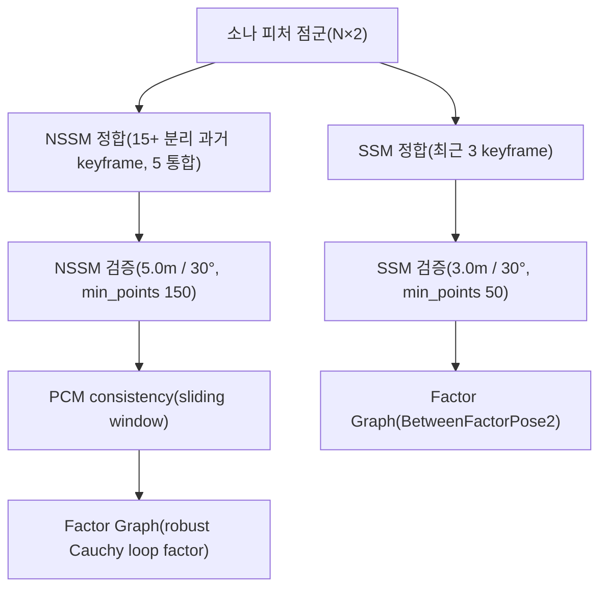
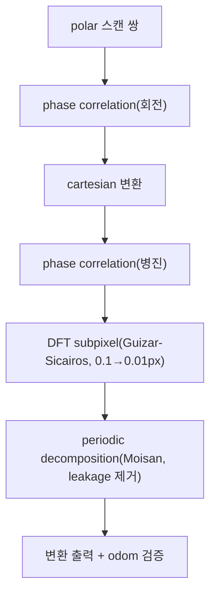

# 위치 추정(ICP·FFT)

이 페이지는 stonefish_slam의 위치 추정 방법인 ICP 스캔매칭(연속 SSM과 루프클로저 NSSM)과 선택적 FFT 기반 변환 추정을 다룬다. 두 방식 모두 소나 피처에서 추출한 점군을 정합하여 키프레임 간 상대 변환(Pose2)을 산출하며, 결과는 factor graph의 제약으로 들어간다.

## 두 가지 스캔매칭: SSM과 NSSM

위치 추정은 시간적으로 가까운 키프레임끼리 정합하는 **SSM**(Sequential Scan Matching, 연속)과, 시간적으로 멀리 떨어진 과거 키프레임과 정합하는 **NSSM**(Non-Sequential Scan Matching, 루프클로저)으로 나뉜다. 두 방식은 같은 ICP 엔진을 쓰지만 정합 대상·통합 프레임 수·검증 임계값·robust 모델이 다르다.

| 항목 | SSM(연속) | NSSM(루프클로저) |
|-----|----------|-----------------|
| 정의 위치 | `localization.py`의 `initialize_sequential_scan_matching`(:342) | `localization.py`의 `initialize_nonsequential_scan_matching`(:430) + `factor_graph.py` |
| 활성 파라미터 | `ssm.enable`(기본 `false`) | `nssm.enable`(기본 `false`) |
| 정합 대상 | 최근 키프레임 | `min_st_sep`(`15`) 이상 떨어진 과거 키프레임 |
| 통합 프레임 수 | `target_frames`(`3`) | `source_frames`(`5`) |
| 최소 점 수 | `ssm.min_points`(`50`) | `min_points`(`150`) |
| 최대 병진 | `max_translation`(`3.0m`) | `max_translation`(`5.0m`, strict) |
| 최대 회전 | `max_rotation`(`0.5236rad`=30°) | `max_rotation`(`0.5236rad`=30°) |
| consistency 검증 | 없음 | PCM(sliding window) |
| robust 모델 | non-robust | Cauchy(`c=3.0`) |

SSM은 최근 `target_frames`(`3`)개 키프레임의 점군을 통합한 뒤 현재 피처와 ICP로 정합하고, NSSM은 멀리 떨어진 과거 키프레임을 후보로 `source_frames`(`5`)개를 통합하여 정합한다. NSSM은 루프클로저 특성상 잘못된 정합이 그래프 전체를 오염시킬 수 있으므로 더 strict한 검증(`5.0m`/30°)과 PCM consistency, robust Cauchy를 함께 적용한다.

!!! note "기본값은 비활성"
    `ssm.enable`, `nssm.enable`, `fft_localization.enable` 모두 기본값이 `false`다(`slam.yaml`). 스캔매칭 기반 위치 추정을 쓰려면 launch에서 `ssm_enable:=true nssm_enable:=true`로 켜야 한다.

## ICP 정합 엔진

ICP(Iterative Closest Point)는 두 점군을 반복적으로 대응시켜 상대 변환을 구하는 핵심 정합 알고리즘이다. stonefish_slam은 C++ 확장이 빌드되어 있으면 libpointmatcher를, 없으면 순수 Python fallback을 쓴다.

### C++ 경로 (libpointmatcher)

C++ ICP(`pcl.cpp`)는 libpointmatcher의 **Point-to-Point** errorMinimizer를 사용한다(`icp.yaml`의 `errorMinimizer(PointToPoint)`). 대응점 탐색은 KDTree(`KDTreeMatcher.knn(1)`, `maxDist(10.0m)`)로 하고, outlier는 두 단계로 거른다: `MaxDistOutlierFilter.maxDist(3.0m)`로 멀리 떨어진 대응을 제거하고, `TrimmedDistOutlierFilter.ratio(0.8)`로 거리 상위 비율을 잘라낸다(TrimmedDist). 반복은 `maxIterationCount(40)`까지, 수렴 조건은 `minDiffTransErr(0.1m)`·`minDiffRotErr(0.01rad)`다.

| 파라미터 | 기본값 | 의미 |
|---------|--------|------|
| `KDTreeMatcher.knn` | `1` | 최근접 대응점 1개 |
| `KDTreeMatcher.maxDist` | `10.0` | 대응점 탐색 최대 거리(m) |
| `MaxDistOutlierFilter.maxDist` | `3.0` | 대응 거리 상한(m) |
| `TrimmedDistOutlierFilter.ratio` | `0.8` | 거리 기준 유지 비율(TrimmedDist) |
| `errorMinimizer` | `PointToPoint` | 점-점 오차 최소화 |
| `maxIterationCount` | `40` | ICP 최대 반복 |
| `minDiffTransErr` | `0.1` | 병진 수렴 임계(m) |
| `minDiffRotErr` | `0.01` | 회전 수렴 임계(rad) |

### Python fallback 경로

C++ 확장(`.so`)이 빌드되지 않은 환경에서는 `cpp/__init__.py`의 `try/except ImportError`가 순수 Python fallback(`pcl.py`)을 쓴다. fallback ICP는 **Kabsch + SVD**로 변환을 닫힌형으로 추정한다.

!!! warning "P4a outlier_ratio 정정 (0.8 → 1.0)"
    Python fallback ICP의 outlier 비율은 P4a에서 `0.8`에서 `1.0`으로 수정되었다. 두 점군이 완전히 겹치는(perfect overlap) 경우 `0.8` 비율은 정상 대응점까지 잘라내 정합 정확도를 떨어뜨렸으며, `1.0`으로 바꿔 완전 겹침 상황을 복원했다. C++ 경로의 `TrimmedDistOutlierFilter.ratio(0.8)`와 의도적으로 다른 값임에 유의한다.

!!! tip "C++ ↔ fallback 동기화"
    C++ ICP 로직을 바꾸면 Python fallback도 함께 동기화해야 한다(`CONVENTIONS §2.9`). 두 경로의 결과가 갈라지면, 같은 입력에서 C++ 빌드 유무에 따라 SLAM 결과가 달라진다.

## SSM 검증

SSM 정합 결과는 그래프에 넣기 전에 검증한다(`localization.py`의 `initialize_sequential_scan_matching`, `keyframe` 판정은 `is_keyframe`:94). 통합된 점이 `ssm.min_points`(`50`) 미만이면 정합을 skip하고, 정합으로 나온 변환이 `max_translation`(`3.0m`) 또는 `max_rotation`(`0.5236rad`=30°)를 초과하면 기각한다. 검증을 통과하지 못하면 odometry pose를 그대로 사용하며, 처리 결과는 `STATUS` enum으로 반환된다(`types.py`). 통과한 변환은 `BetweenFactorPose2`로 factor graph에 추가된다.

## NSSM 루프클로저와 PCM

NSSM은 현재 키프레임과 시간적으로 멀리 떨어진 과거 키프레임 사이의 루프를 닫는다. 후보는 `min_st_sep`(`15`) 키프레임 이상 떨어진 과거 프레임으로 한정하고, 정합 시 `source_frames`(`5`)개를 통합한다. 검증은 SSM보다 strict하게 `max_translation`(`5.0m`)·`max_rotation`(`0.5236rad`=30°)·`min_points`(`150`)를 쓴다.

루프 후보가 검증을 통과해도 곧바로 받아들이지 않고 **PCM**(Pairwise Consistency Maximization)으로 한 번 더 거른다. `pcm_queue_size`(`5`)의 sliding window에 최근 루프를 모아 쌍 단위 consistency를 검사하고, consistent한 루프가 `min_pcm`(`3`) 이상일 때만 받아들인다. 쌍 consistency 판정에는 chi-square 임계 `chi2.ppf(0.99, 3)`=11.34를 사용한다.

받아들여진 NSSM 루프는 robust noise model로 그래프에 들어간다(`add_icp_factor`, `factor_graph.py`). robust 모델은 `gtsam.noiseModel.Robust(Cauchy(c=3.0), base)`이며, **NSSM 루프클로저 factor에만** 적용된다(SSM·odometry factor는 non-robust). Cauchy weight는

\[
w(x) = \frac{1}{1 + (x/c)^2}, \quad c = 3.0
\]

으로, 3σ 지점에서 weight ≈ 0.5가 되어 down-weight하되 완전 기각은 하지 않는다(`create_robust_full_noise_model`, `factor_graph.py:421-436`, 기본 `robust_loop_c(3.0)`는 `factor_graph.py:51`). 이로써 PCM을 통과한 outlier 루프 한두 개가 그래프 최적화를 망치지 않는다.

| 파라미터 | 기본값 | 의미 |
|---------|--------|------|
| `nssm.min_st_sep` | `15` | 루프 후보 최소 키프레임 분리 |
| `min_points` | `150` | NSSM 최소 점 수 |
| `max_translation` | `5.0` | NSSM 병진 상한(m, strict) |
| `max_rotation` | `0.5236` | NSSM 회전 상한(rad=30°) |
| `source_frames` | `5` | NSSM 통합 프레임 수 |
| `cov_samples` | `30` | 공분산 샘플 수(`0`=비활성) |
| `pcm_queue_size` | `5` | PCM sliding window 크기 |
| `min_pcm` | `3` | 최소 consistent 루프 수 |
| `slam_loop_robust_c` | `3.0` | Cauchy 파라미터(NSSM만) |

## FFT 위치 추정 (선택)

FFT 기반 위치 추정(`localization_fft.py`)은 ICP와 별개의 선택적 경로로, Hurtós(2015) 방식의 주파수 영역 정합을 쓴다. `fft_localization.enable`(기본 `false`)로 켜며, P4 신규 standalone 노드 `fft_localization_node`로도 단독 실행할 수 있다(`/fft_localization/transform` 발행).

처리 순서는 다음 네 단계다.

1. **회전 추정** — 극좌표(polar)에서 phase correlation으로 두 스캔 간 회전을 구한다.
2. **병진 추정** — cartesian으로 변환한 뒤 phase correlation으로 병진을 구한다.
3. **Subpixel 정밀화** — DFT 기반 subpixel refinement(Guizar-Sicairos 2008)로 `0.1px`에서 `0.01px` 수준까지 정밀도를 높인다.
4. **Periodic decomposition** — Moisan(2011)의 periodic-plus-smooth 분해로 spectral leakage를 제거하여 phase correlation 정확도를 높인다.

FFT 결과는 odometry로 검증할 수 있다. `validate_with_odom`(기본 `true`)일 때 `max_position_error`(`0.5m`)·`max_rotation_error`(`0.0872665rad`≈5°)를 넘으면 기각한다. 회전은 dead reckoning 값을 쓸 수 있고(`use_dr_rotation`, `true`), 병진 전처리에는 erosion(`trans_erosion_iterations`, `2`)과 Gaussian smoothing(`trans_gaussian_sigma`, `2.0`; `trans_gaussian_truncate`, `3.0`)을 적용한다.

| 파라미터 | 기본값 | 의미 |
|---------|--------|------|
| `fft_localization.enable` | `false` | FFT 경로 활성 |
| `range_min` | `0.5` | 최소 range(m) |
| `validate_with_odom` | `true` | odom 검증 사용 |
| `max_position_error` | `0.5` | 위치 오차 상한(m) |
| `max_rotation_error` | `0.0872665` | 회전 오차 상한(rad≈5°) |
| `use_dr_rotation` | `true` | dead reckoning 회전 사용 |
| `trans_erosion_iterations` | `2` | 병진 전처리 erosion 횟수 |
| `trans_gaussian_sigma` | `2.0` | 병진 Gaussian sigma |
| `trans_gaussian_truncate` | `3.0` | Gaussian truncate |

!!! note "FFT는 ICP의 대안이 아닌 선택 경로"
    FFT 위치 추정은 기본 비활성이며, ICP 스캔매칭(SSM/NSSM)과 독립적으로 켤 수 있다. standalone 노드(`fft_localization_standalone.launch.py`)로 변환만 산출하는 용도로도 쓸 수 있다.

## 파라미터 출처

이 페이지의 파라미터 기본값은 `localization.yaml`(키프레임·SSM·노이즈), `factor_graph.yaml`(NSSM·PCM), `icp.yaml`(libpointmatcher), `slam.yaml`(FFT 플래그)에서 declare된다(`slam.py:44-154`). 위치 추정 파라미터의 노이즈 모델·키프레임 결정·그래프 연결 전반은 [localization-graph](../parameters/localization-graph.md)에서 확인한다.
