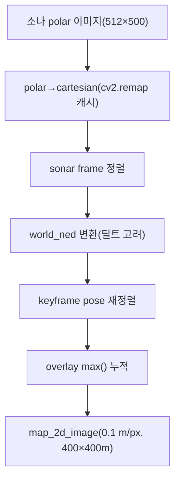
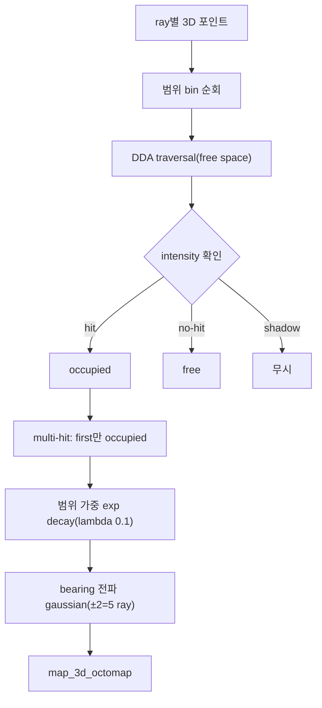

# 매핑(2D·3D OctoMap)

stonefish_slam의 매핑은 소나 극좌표 이미지를 두 가지 표현으로 누적한다. 2D 점유 그리드(`mapping_2d.py`)는 polar→cartesian 변환 후 `world_ned`로 정렬해 overlay max()로 덮어 쌓고, 3D OctoMap(`mapping_3d.py` + `ray_processor.cpp` + `octree_mapping.cpp`)은 ray별 DDA traversal로 free space를 비우고 hit voxel을 점유로 갱신한다. 이 페이지는 두 경로의 알고리즘, 3가지 OctoMap 업데이트법(`log_odds`/`weighted_avg`/`iwlo`), IWLO 가중 수식, 그리고 P4a 버그 수정을 설명한다. 파라미터 기본값은 [파라미터 레퍼런스](../parameters/mapping.md)를 참조한다.

## 2D 점유 그리드 (`mapping_2d.py`)

2D 매핑은 소나 극좌표 이미지를 cartesian 평면에 누적해 top-down 점유 이미지를 만든다. 처리 순서는 polar→cartesian 변환(`cv2.remap`, 변환 맵 캐시), sonar frame 정렬, `world_ned`로의 변환(소나 틸트 고려), keyframe pose 기준 재정렬, 그리고 overlay max()로 기존 맵 위에 덮어 쌓는 단계로 이어진다. 결과 맵은 `0.1` m/pixel 해상도의 `4000×4000` 픽셀 그리드로, 실제 `400×400` m 영역을 표현한다. Stonefish 시뮬레이터의 진실 반사율(ground-truth reflectivity)을 입력으로 사용한다.

overlay 누적은 max() 연산이므로 한 셀에 여러 관측이 들어오면 더 강한 반사가 보존된다. 관련 파라미터는 `map_2d_resolution`(`0.1`), `map_size`(`[4000,4000]`), `map_update_interval`(`1`), `intensity_threshold`(`10`)이다.

## 3D OctoMap (`mapping_3d.py`)

3D 매핑은 각 소나 ray를 따라 3D 포인트를 생성하고, ray가 통과한 voxel을 비우며(free) ray가 닿은 voxel을 채운다(occupied). 처리 흐름은 ray별 3D 포인트 계산, 범위(range) bin 순회, DDA traversal로 free space 확보, intensity 확인을 통한 hit/no-hit 판정, 범위 가중 exp decay, 그리고 bearing 방향 gaussian 전파로 구성된다. 백엔드는 C++ 확장(`ray_processor.cpp`, `octree_mapping.cpp`)을 기본 사용한다(`use_cpp_backend`=true, `use_cpp_ray_processor`=true).

### ray 처리 규칙

각 ray의 점유/자유 판정은 다음 규칙을 따른다. ray가 voxel에 닿으면 occupied, 닿지 않으면 그 구간은 free로 비우고, shadow 영역은 무시한다. 한 ray에서 여러 hit이 발생해도(multi-hit) 첫 번째 hit만 occupied로 처리한다. 점유 갱신량은 범위에 따라 exp decay로 가중되며 감쇠 계수는 `lambda_decay`(`0.1`)이다. bearing(방위각) 방향으로는 gaussian 전파가 적용되어, `propagation_radius`(`2`)에 의해 중심 ray 양옆 ±2개를 포함한 총 5개 ray로 전파되고 분포 폭은 `propagation_sigma`(`1.5`)로 정해진다.

bearing 샘플링은 `bearing_step`(`4`)로 다운샘플되어 512개 beam 중 512/4=128개 bearing만 처리한다. OctoMap 자체는 resolution `0.3` m(`map_3d_voxel_size`), `min_probability`(`0.7`)로 동작한다.

!!! note "C++ 백엔드와 fallback"
    3D 매핑은 pybind11 C++ 확장(`ray_processor`, `dda_traversal`, `octree_mapping`)을 기본 사용한다. `use_dda_traversal`, `use_cpp_ray_processor`, `use_cpp_backend` 플래그로 제어하며, C++ 미빌드 시 순수 Python 경로로 fallback한다. C++ 헤더(`ray_processor.h`)의 기본 상수는 YAML과 별도로 정의되어 있어(예: `log_odds_occupied`=`0.5`, `log_odds_free`=`-5.0`, `bearing_step`=`2`, `intensity_threshold`=`30`, `update_method`=`0`(LOG_ODDS)), C++ 변경 시 Python fallback과의 동기화가 필요하다(CONVENTIONS §2.9).

## 업데이트법 3종 비교

OctoMap voxel의 점유 확률 갱신은 `update_method` 파라미터로 선택하며 세 가지 방식이 있다. 기본값은 `iwlo`이다.

| 방법 | 갱신식 | 강도(intensity) 반영 | 특징 |
|:---|:---|:---|:---|
| `log_odds` | \( L_{new} = L_{old} + \Delta L \) | 무시 | 고전적 OctoMap 확률론적 갱신. 강도 정보를 쓰지 않음 |
| `weighted_avg` | EMA(지수이동평균) | intensity 가중 | intensity로 가중한 이동평균 누적 |
| `iwlo` | \( L_{new} = L_{old} + \Delta L \cdot w(I) \cdot \alpha(n) \) | intensity 가중 + 관찰 감쇠 | P4 신규. 강도 가중과 학습률 감쇠를 결합 |

log-odds clamp 범위는 업데이트법마다 별도 config로 정의된다. IWLO는 `[-20, 10]`(`log_odds_min`=`-20.0`, `log_odds_max`=`10.0`)로 clamp한다.

## IWLO (Intensity-Weighted Log-Odds)

IWLO는 P4에서 추가된 기본 업데이트법으로, log-odds 증분 \( \Delta L \)에 두 개의 보정 인자를 곱한다. 강도 가중 \( w(I) \)와 관찰 횟수 감쇠 \( \alpha(n) \)이다.

\[ L_{new} = L_{old} + \Delta L \cdot w(I) \cdot \alpha(n) \]

강도 가중 \( w(I) \)는 sigmoid 함수로, 강도가 중심값을 넘으면 0.5보다 커진다(강한 echo → 1.0에 근접). 실제 구현(`ray_processor.cpp:429-434`)은 다음과 같다:

\[ w(I) = \frac{1}{1 + e^{-x}}, \qquad x = \frac{I - I_{mid}}{\text{sharpness}\cdot\text{scale}} \]

여기서 sigmoid의 중심 \( I_{mid} = \)`intensity_max`\(/2 = 127.5\), 스케일 \(\text{scale} = \)`intensity_max`\(/5 = 51.0\)이다. `sharpness`(`0.1`)는 **분모**에 들어가 작을수록 전이가 급격해진다. 별도의 `intensity_threshold`(`35`)는 이 가중과 무관하게 관찰을 채택할지 거르는 하한이다.

관찰 감쇠 \( \alpha(n) \)은 같은 voxel을 여러 번 관찰할수록 갱신 폭을 줄이는 학습률 감쇠로, 첫 관찰에서는 1.0, 관찰이 누적될수록 `min_alpha`(`0.3`)로 수렴한다:

\[ \alpha(n) = \text{min\_alpha} + (1 - \text{min\_alpha}) \cdot \exp(-\text{decay} \cdot n) \]

여기서 `decay_rate`(`0.1`)는 감쇠율이다. IWLO 전용 log-odds 상수는 `log_odds_occupied`(`2.0`), `log_odds_free`(`-6.0`, strong clearing)로, free 갱신이 occupied보다 강하게 적용되어 빈 공간을 빠르게 비운다.

!!! tip "IWLO를 쓰는 이유"
    `log_odds`는 강도를 무시하므로 약한 반사와 강한 반사를 동일하게 취급한다. IWLO는 \( w(I) \)로 강한 echo에 더 큰 신뢰를 부여하고, \( \alpha(n) \)으로 충분히 관찰된 voxel의 과도한 누적을 억제한다. adaptive 갱신(`adaptive_update`=true, `adaptive_threshold`=`0.5`, `adaptive_max_ratio`=`0.3`)도 함께 동작한다.

## P4a 버그 수정

P4a에서 3D 매핑 경로의 두 가지 좌표/스케일 버그가 수정되었다.

| 버그 | 수정 전 | 수정 후 | 효과 |
|:---|:---|:---|:---|
| octree leaf 크기 | resolution의 2× | `resolution + 1e-9`(≤resolution) | voxel이 의도한 해상도(`0.3` m)로 생성됨 |
| DDA traversal 시작점 | voxel corner | voxel center | ray가 셀 모서리가 아닌 중심을 통과해 bias 제거 |

!!! warning "버그 수정의 동작 변경 영향"
    이 두 수정은 매핑 결과를 의도적으로 바꾼다. octree leaf 2×→1× 수정으로 voxel이 더 촘촘해지고, DDA corner→center 수정으로 ray traversal 경로가 달라진다. 따라서 P4a 이전 맵과 직접 비교하면 동일하지 않다. 이 변경이 v0.4.0이 minor bump인 이유 중 하나다(의도적 동작 변경).

## 관련 페이지

- 파라미터 기본값 전체: [파라미터 레퍼런스](../parameters/mapping.md)
