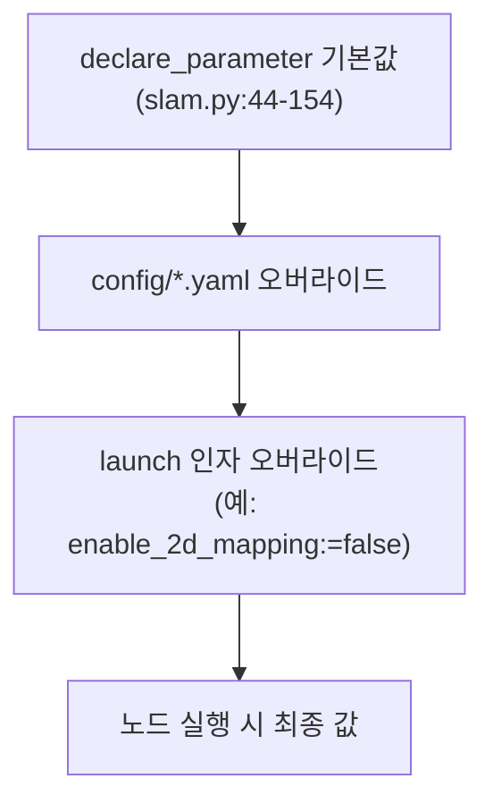

# 파라미터 개요와 사용법

이 페이지는 stonefish_slam의 파라미터를 **어디서 어떻게 수정하나**를 먼저 설명한다. 모든 파라미터는 `config/` 디렉터리의 YAML 11개 파일에 정의되어 있고, 노드는 `slam.py:44-154`의 `declare_parameter`(총 82회)로 이를 선언한 뒤 YAML 또는 launch 인자로 오버라이드한다.

## 수정 위치: config/ YAML 11개 파일

파라미터는 모두 `config/` 아래 YAML 파일에 모여 있다. 용도별로 파일이 분리되어 있어 수정 대상 파일을 먼저 찾는 것이 출발점이다.

| 파일 | 용도 | 대표 파라미터 |
|------|------|--------------|
| `config/slam.yaml` | 통합 SLAM 플래그·FFT 위치추정 | `enable_2d_mapping`, `enable_3d_mapping`, `ssm.enable`, `nssm.enable`, `fft_localization.enable` |
| `config/sonar.yaml` | FLS 소나 하드웨어 사양 | `vehicle_name`, `horizontal_fov`, `num_beams`, `range_max`, `sonar_tilt_deg` |
| `config/feature.yaml` | CFAR 피처 추출 | `CFAR.alg`, `CFAR.Ntc`, `CFAR.Pfa`, `filter.threshold`, `resolution` |
| `config/localization.yaml` | 키프레임·노이즈 모델·ICP | `keyframe_duration`, `slam_icp_noise`, `slam_loop_robust_c`, `icp_config` |
| `config/factor_graph.yaml` | NSSM 루프 클로저·PCM | `nssm.min_st_sep`, `nssm.source_frames`, `pcm_queue_size`, `min_pcm` |
| `config/mapping.yaml` | 2D 점유그리드·3D OctoMap | `map_2d_resolution`, `map_3d_voxel_size`, `update_method`, `use_cpp_backend` |
| `config/dead_reckoning.yaml` | DVL/IMU 추측항법 | `dvl_max_velocity`, `imu_pose`, `keyframe_translation` |
| `config/icp.yaml` | libpointmatcher ICP 설정 | `KDTreeMatcher.knn`, `MaxDistOutlierFilter.maxDist`, `maxIterationCount` |
| `config/mapping/method_iwlo.yaml` | IWLO 강도 가중 갱신법(P4 신규) | `log_odds_occupied`, `intensity_threshold`, `sharpness`, `decay_rate` |
| `config/mapping/method_*.yaml` | 그 외 3D 갱신법 설정 | 갱신법별 로그-오즈·가중 파라미터 |

!!! note "11개 파일 구성"
    최상위 8개 파일(`slam.yaml`, `sonar.yaml`, `feature.yaml`, `localization.yaml`, `factor_graph.yaml`, `mapping.yaml`, `dead_reckoning.yaml`, `icp.yaml`)에 `mapping/` 하위 3개 갱신법 YAML(`method_iwlo.yaml` 등)을 더해 총 11개다.

## 파라미터가 적용되는 경로

노드는 시작 시 `declare_parameter`로 파라미터를 선언하고 기본값을 잡는다(`slam.py:44-154`). 실제 값은 YAML 파일 또는 launch 인자로 오버라이드되며, 같은 키를 launch 인자로 넘기면 YAML 값보다 우선한다.



launch 인자로 자주 넘기는 값은 다음과 같다.

```bash
# 2D 매핑 끄고 실행
ros2 launch stonefish_slam slam.launch.py enable_2d_mapping:=false

# 연속 스캔매칭(SSM)과 루프 클로저(NSSM) 켜고 실행
ros2 launch stonefish_slam slam.launch.py ssm_enable:=true nssm_enable:=true

# 다른 차량·RViz 비활성
ros2 launch stonefish_slam slam.launch.py vehicle_name:=x500 rviz:=false
```

!!! warning "수정 후 재실행 필요"
    파라미터는 노드 시작 시 `declare_parameter`로 한 번 읽힌다. YAML을 수정해도 실행 중인 노드에는 반영되지 않으므로, 값을 바꾼 뒤에는 노드를 다시 실행해야 한다.

## icp_config 절대경로 하드코딩 주의

`localization.yaml`의 `icp_config`는 libpointmatcher ICP 설정 파일(`icp.yaml`)을 가리키는데, **절대경로가 하드코딩**되어 있다. 이는 P4 단계에서 플래그로 식별된 항목으로, 환경마다 경로가 달라 그대로 두면 동작하지 않을 수 있다.

!!! warning "icp_config 절대경로 (P4 flag)"
    `icp_config`는 절대경로가 하드코딩되어 있다. 다른 환경에서는 launch 인자로 오버라이드해 자신의 `config/icp.yaml` 경로를 지정해야 한다. 절대경로를 그대로 쓰면 ICP 설정 파일을 찾지 못한다.

## 상세 페이지

용도별 파라미터의 전체 레퍼런스는 아래 상세 페이지에서 다룬다.

| 페이지 | 다루는 범위 |
|--------|------------|
| [소나·피처 파라미터](sonar-feature.md) | `sonar.yaml`(FLS 사양), `feature.yaml`(CFAR·필터·시각화) |
| [위치추정·팩터그래프 파라미터](localization-graph.md) | `localization.yaml`(키프레임·노이즈·SSM), `factor_graph.yaml`(NSSM·PCM), `icp.yaml`(libpointmatcher) |
| [매핑(2D·3D) 파라미터](mapping.md) | `mapping.yaml`(2D/3D 공통), `mapping/method_*.yaml`(log_odds·weighted_avg·IWLO) |
