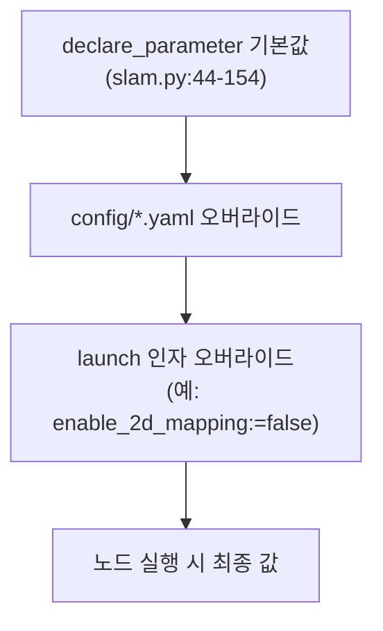

# 파라미터 개요와 사용법

이 페이지는 stonefish_slam의 파라미터를 **어디서 어떻게 수정하나**를 먼저 설명한다. `slam_node`의 모든 파라미터는 `config/slam.yaml` **한 파일**에 섹션별로 정의되어 있고(2026-09-02 통합 — 이전의 `sonar/feature/localization/factor_graph/mapping.yaml` 6개는 이 파일의 섹션이 됐다), 노드는 `slam.py`의 `declare_parameter`로 이를 선언한 뒤 YAML 또는 launch 인자로 오버라이드한다.

## 수정 위치: config/slam.yaml 의 섹션

노드 파라미터는 `config/slam.yaml` 한 파일에 섹션 주석(`# ==== … ====`)으로 나뉘어 있다. 수정할 섹션을 먼저 찾는 것이 출발점이다. 나머지 파일은 성격이 다른 것만 따로 둔다.

| 파일 / 섹션 | 용도 | 대표 파라미터 |
|------|------|--------------|
| `config/slam.yaml` — Data source · Module switches | 입력 토픽, 모듈 on/off | `vehicle_name`, `sonar_topic`, `enable_2d_mapping`, `enable_3d_mapping`, `publish_point_cloud` |
| `config/slam.yaml` — Sonar hardware | FLS 소나 사양 | `sonar.horizontal_fov`, `sonar.num_beams`, `sonar.range_max`, `sonar.sonar_tilt_deg` |
| `config/slam.yaml` — Feature extraction | CFAR 피처 추출 | `CFAR.alg`, `CFAR.Ntc`, `CFAR.Pfa`, `filter.threshold`, `filter.resolution` |
| `config/slam.yaml` — Keyframes & noise | 키프레임·노이즈 모델 | `keyframe_duration`, `slam_icp_noise`, `slam_loop_robust_c` |
| `config/slam.yaml` — ssm / nssm / pcm | 연속 스캔매칭(ICP)·루프 클로저·PCM | `ssm.enable`, `ssm.target_frames`, `nssm.enable`, `nssm.min_st_sep`, `pcm_queue_size`, `min_pcm` |
| `config/slam.yaml` — fft_localization | ICP 시드용 FFT 추정 | `fft_localization.enable`, `max_position_error`, `use_dr_rotation` |
| `config/slam.yaml` — mapping_2d / mapping_3d | 2D 점유그리드·3D OctoMap | `map_2d_resolution`, `map_3d_voxel_size`, `update_method`, `use_cpp_backend` |
| `config/mapping/method_*.yaml` | 3D 갱신법별 값 (`update_method`가 선택) | `log_odds_occupied`, `intensity_threshold`, `sharpness`, `decay_rate` |
| `config/icp.yaml`, `config/icp_real_bag.yaml` | libpointmatcher ICP 체인 (`icp_config_file`이 선택) | `KDTreeMatcher.knn`, `MaxDistOutlierFilter.maxDist`, `maxIterationCount` |
| `config/real_bag_overrides.yaml` | 실해역 bag 프로파일 (`override_config`로 뒤에 로드) | `sonar_topic`, `odom_topic`, `sonar_compressed`, `nssm.cov_samples` |
| `config/dead_reckoning.yaml` | DVL/IMU 추측항법(별도 노드) | `dvl_max_velocity`, `imu_pose`, `keyframe_translation` |

!!! note "8개 파일 구성"
    최상위 5개(`slam.yaml`, `real_bag_overrides.yaml`, `icp.yaml`, `icp_real_bag.yaml`, `dead_reckoning.yaml`)에 `mapping/` 하위 3개 갱신법 YAML을 더해 총 8개다. 우선순위(뒤가 이김): `slam.yaml` < `method_*.yaml` < `override_config` < launch `mode` preset < 명시 launch 인자.

## 파라미터가 적용되는 경로

노드는 시작 시 `declare_parameter`로 파라미터를 선언하고 기본값을 잡는다(`slam.py:44-154`). 실제 값은 YAML 파일 또는 launch 인자로 오버라이드되며, 같은 키를 launch 인자로 넘기면 YAML 값보다 우선한다.


```mermaid
flowchart TD
    A["declare_parameter 기본값<br/>(slam.py:44-154)"] --> B["config/*.yaml 오버라이드"]
    B --> C["launch 인자 오버라이드<br/>(예: enable_2d_mapping:=false)"]
    C --> D["노드 실행 시 최종 값"]
```

launch 인자로 자주 넘기는 값은 다음과 같다.

```bash
# 2D 매핑 끄고 실행
ros2 launch stonefish_slam slam.launch.py enable_2d_mapping:=false

# 스캔매칭 없이 매핑만 / 매핑 없이 위치추정만
ros2 launch stonefish_slam slam.launch.py mode:=mapping
ros2 launch stonefish_slam slam.launch.py mode:=localization

# 다른 차량·RViz 비활성
ros2 launch stonefish_slam slam.launch.py vehicle_name:=x500 rviz:=false
```

!!! warning "수정 후 재실행 필요"
    파라미터는 노드 시작 시 `declare_parameter`로 한 번 읽힌다. YAML을 수정해도 실행 중인 노드에는 반영되지 않으므로, 값을 바꾼 뒤에는 노드를 다시 실행해야 한다.

## icp_config 는 yaml 이 아니라 launch 가 정한다

`icp_config`(libpointmatcher 체인 파일 경로)는 `config/slam.yaml`에 없다. `slam.launch.py`가 `icp_config_file` 인자(기본 `icp.yaml`, 실해역은 `icp_real_bag.yaml`)를 패키지 share 경로에 붙여 노드에 넘긴다. 예전 `localization.yaml`의 절대경로 하드코딩(P4 flag)은 2026-09-01에 제거됐다.

## 상세 페이지

용도별 파라미터의 전체 레퍼런스는 아래 상세 페이지에서 다룬다.

| 페이지 | 다루는 범위 |
|--------|------------|
| [소나·피처 파라미터](sonar-feature.md) | `slam.yaml`(FLS 사양), `slam.yaml`(CFAR·필터·시각화) |
| [위치추정·팩터그래프 파라미터](localization-graph.md) | `slam.yaml`(키프레임·노이즈·SSM), `slam.yaml`(NSSM·PCM), `icp.yaml`(libpointmatcher) |
| [매핑(2D·3D) 파라미터](mapping.md) | `slam.yaml`(2D/3D 공통), `mapping/method_*.yaml`(log_odds·weighted_avg·IWLO) |
