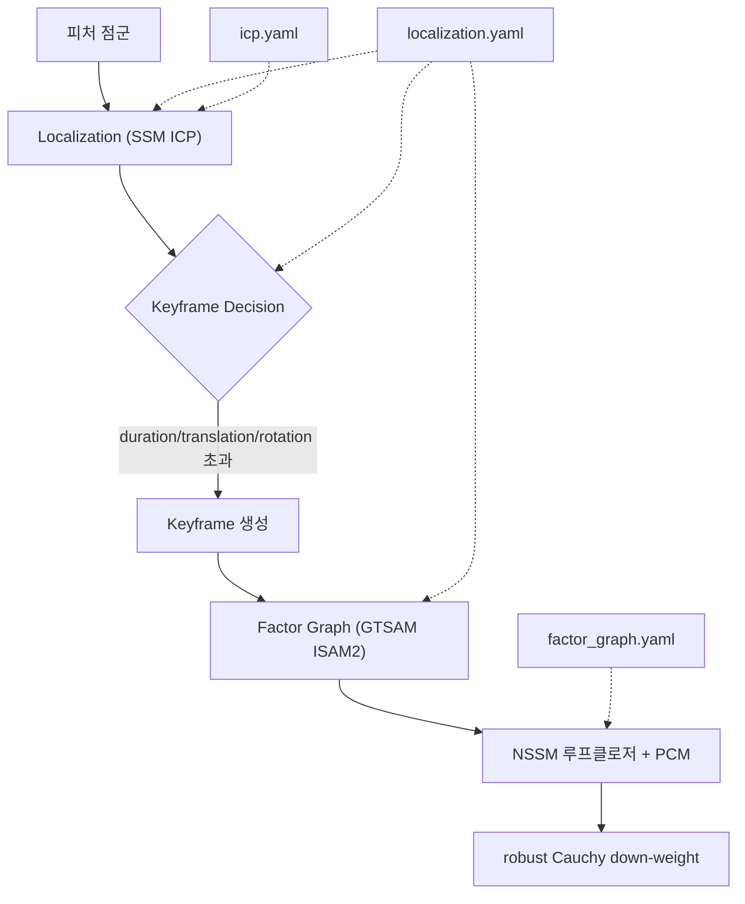

# 위치추정·팩터그래프 파라미터

이 페이지는 stonefish_slam의 위치추정·루프클로저·스캔매칭을 제어하는 세 설정 파일 `localization.yaml`(키프레임·노이즈·SSM), `factor_graph.yaml`(NSSM 루프클로저·PCM), `icp.yaml`(libpointmatcher ICP)의 모든 파라미터를 이름·기본값·정의·수정 효과까지 빠짐없이 정리하는 레퍼런스다.

이 세 파일은 SLAM 파이프라인의 `Localization → Keyframe Decision → Factor Graph` 단계를 직접 지배한다. 키프레임 생성 주기(`localization.yaml`), GTSAM 팩터그래프에 들어가는 노이즈 모델과 루프클로저 검증(`localization.yaml` + `factor_graph.yaml`), 그리고 스캔매칭의 점 정합 품질(`icp.yaml`)이 모두 여기서 결정된다.

## localization.yaml — 키프레임·노이즈·SSM

이 파일은 키프레임을 언제 만들지(주기·이동·회전 임계값), GTSAM 팩터그래프 각 팩터의 노이즈 sigma, NSSM 루프클로저의 robust 강도, 그리고 연속 스캔매칭(SSM) 검증 기준을 정의한다. 파라미터는 `slam.py:44-154`에서 `declare_parameter`로 선언된다(분석 사실 §3).

### 키프레임 생성 임계값

새 키프레임은 세 조건(경과 시간·누적 이동·누적 회전) 중 하나라도 초과하면 생성된다.

| 파라미터 | 기본값 | 정의·의미 |
|---|---|---|
| `keyframe_duration` | `1.0`(초) | 직전 키프레임 이후 이 시간이 지나면 새 키프레임을 만든다. |
| `keyframe_translation` | `1.0`(m) | 직전 키프레임 대비 이동 거리가 이 값을 넘으면 새 키프레임을 만든다. |
| `keyframe_rotation` | `0.174533`(rad = 10°) | 직전 키프레임 대비 회전이 이 각을 넘으면 새 키프레임을 만든다. |

!!! tip "키프레임 임계값 수정 효과"
    세 값을 **작게** 하면 키프레임이 더 자주 생성되어 궤적이 촘촘해지고 맵 갱신 해상도가 올라가지만, 팩터그래프 노드 수가 늘어 최적화 비용이 커진다. **크게** 하면 키프레임이 드물어져 계산은 가벼워지지만 빠른 기동에서 변위를 놓칠 수 있다.

### 노이즈 모델 sigma

GTSAM 팩터그래프의 각 팩터는 `noiseModel.Diagonal.Sigmas`로 모델링되며, 세 값은 각각 `[x_m, y_m, theta_rad]` 순서다(`slam.py:114-123`). sigma가 작을수록 해당 측정의 신뢰도가 높다는 뜻이고, 클수록 신뢰도가 낮다는 뜻이다.

| 파라미터 | 기본값 `[x, y, θ]` | 적용 팩터 | 의미 |
|---|---|---|---|
| `slam_prior_noise` | `[0.1, 0.1, 0.01]` | `PriorFactorPose2` | 초기 위치(prior)의 불확실성. |
| `slam_odom_noise` | `[0.2, 0.2, 0.02]` | `BetweenFactorPose2`(오도메트리) | 키프레임 간 오도메트리 상대 변환의 불확실성. |
| `slam_icp_noise` | `[0.1, 0.1, 0.01]` | `BetweenFactorPose2`(ICP) | ICP 스캔매칭 상대 변환의 불확실성. |

!!! warning "노이즈 sigma를 키우면 그 측정의 신뢰가 떨어진다"
    sigma는 측정의 **표준편차**다. 어떤 노이즈 값을 **키우면** 팩터그래프 최적화에서 그 측정의 가중치가 줄어든다 — 즉 해당 측정을 "덜 믿는다". 예를 들어 `slam_icp_noise`를 키우면 ICP 결과의 영향력이 줄고 오도메트리·prior 쪽으로 추정이 끌려간다. 반대로 **줄이면** 그 측정을 강하게 신뢰하여 추정이 그 값에 단단히 고정된다.

    `slam_odom_noise`(`[0.2, 0.2, 0.02]`)가 `slam_icp_noise`(`[0.1, 0.1, 0.01]`)보다 크게 설정된 것은, 오도메트리보다 ICP 스캔매칭을 더 신뢰하도록 기본 균형을 잡은 것이다.

### robust 루프클로저

| 파라미터 | 기본값 | 정의·의미 |
|---|---|---|
| `slam_loop_robust_c` | `3.0` | NSSM 루프클로저 팩터에만 적용되는 Cauchy robust 커널의 파라미터 \(c\). |

NSSM 루프클로저 팩터는 `gtsam.noiseModel.Robust(Cauchy(c=3.0), base)`로 감싸진다(`slam.py`, P4c). Cauchy 가중치는

\[
w(x) = \frac{1}{1 + (x/c)^2}
\]

이며, \(c = 3.0\)일 때 잔차가 3σ인 측정의 가중치는 약 0.5가 된다(완전 기각이 아니라 down-weight). SSM·오도메트리·prior 팩터는 robust가 아닌(non-robust) 모델을 쓴다(`factor_graph.py:51`에 `robust_loop_c` 기본 3.0).

!!! note "robust c 값의 의미"
    \(c\)를 **작게** 하면 같은 잔차에서 가중치가 더 빠르게 떨어져 outlier 루프클로저를 더 강하게 억제한다(보수적). **크게** 하면 down-weight가 완만해져 의심스러운 루프클로저도 더 많이 반영한다. robust 커널은 잘못된 루프클로저(outlier)가 그래프 전체를 망가뜨리는 것을 막으면서도 완전히 버리지는 않는 절충이다.

### 다운샘플·SSM 검증

| 파라미터 | 기본값 | 정의·의미 |
|---|---|---|
| `point_downsample_resolution` | `0.5`(m) | 정합 전 점군 다운샘플 격자 크기. |
| `ssm.min_points` | `50` | SSM 정합에 필요한 최소 점 수. 미만이면 매칭을 건너뛴다. |
| `ssm.max_translation` | `3.0`(m) | SSM 결과 병진이 이 값을 넘으면 매칭을 기각한다. |
| `ssm.max_rotation` | `0.5236`(rad = 30°) | SSM 결과 회전이 이 각을 넘으면 매칭을 기각한다. |
| `ssm.target_frames` | `3` | SSM 정합 대상으로 통합하는 최근 키프레임 개수. |
| `icp_config` | (절대경로) | ICP 설정 파일 경로. 절대경로가 하드코딩되어 있어 launch에서 오버라이드한다(P4 flag). |

연속 스캔매칭(SSM)은 피처를 2D 점으로 변환해 최근 `target_frames`(3) 개 키프레임을 통합한 뒤 `pcl.ICP.compute`로 `Pose2`를 추정한다(`localization.py:94-150`). `max_translation`/`max_rotation`을 초과하면 기각하고, `min_points`(50) 미만이면 건너뛰며, 실패 시 오도메트리 pose를 사용한다.

!!! tip "SSM 검증 임계값 수정 효과"
    `max_translation`/`max_rotation`을 **줄이면** 비정상적으로 큰 정합 결과를 더 엄격히 걸러내 robust해지지만, 정상적인 큰 변위까지 기각할 수 있다. **키우면** 더 큰 변위를 허용하지만 잘못된 매칭이 통과할 위험이 커진다. `target_frames`를 **늘리면** 정합 대상 점이 많아져 매칭이 안정되지만 계산량이 늘어난다.

## factor_graph.yaml — NSSM 루프클로저·PCM

이 파일은 비연속 스캔매칭(NSSM) 기반 루프클로저의 후보 선정·검증 기준과, Pairwise Consistency Maximization(PCM)으로 일관된 루프만 채택하는 기준을 정의한다.

NSSM은 현재 키프레임에서 `min_st_sep`(15) 이상 떨어진 과거 키프레임과 매칭을 시도하고, 최근 `source_frames`(5) 개 키프레임을 통합해 정합한다. 후보 루프는 PCM 슬라이딩 윈도우에서 쌍별 일관성(chi2.ppf(0.99, 3) = 11.34 기준)을 검사해 `min_pcm`(3) 개 이상 일관된 경우에만 채택되며, 채택된 루프는 Cauchy robust로 down-weight된다(`localization.py:150-200` + `factor_graph`).

| 파라미터 | 기본값 | 정의·의미 |
|---|---|---|
| `nssm.min_st_sep` | `15` | 루프클로저 후보로 삼기 위한 현재 키프레임과 과거 키프레임의 최소 분리(키프레임 개수). |
| `nssm.min_points` | `150` | NSSM 정합에 필요한 최소 점 수. 미만이면 시도하지 않는다. |
| `nssm.max_translation` | `5.0`(m) | NSSM 결과 병진이 이 값을 넘으면 기각한다. |
| `nssm.max_rotation` | `0.5236`(rad = 30°) | NSSM 결과 회전이 이 각을 넘으면 기각한다. |
| `nssm.source_frames` | `5` | NSSM 정합을 위해 통합하는 최근 키프레임 개수. |
| `nssm.cov_samples` | `30` | 루프 변환의 공분산 추정 샘플 수. `0`이면 공분산 추정 비활성. |
| `pcm_queue_size` | `5` | PCM 일관성 검사를 수행하는 슬라이딩 윈도우 크기. |
| `min_pcm` | `3` | 루프를 채택하기 위해 필요한 최소 consistent 루프 수. |

!!! warning "NSSM/PCM 임계값 수정 효과"
    `min_st_sep`(15)를 **키우면** 더 멀리 떨어진 과거 키프레임하고만 루프를 닫아 거짓 양성(인접 프레임을 루프로 오인)을 줄이지만, 진짜 루프 기회를 놓칠 수 있다. `nssm.min_points`(150)는 SSM(50)보다 크게 잡혀 있어 — 루프클로저는 잘못 닫히면 그래프 전체를 왜곡하므로 더 많은 점을 요구해 보수적으로 검증한다.

    `min_pcm`(3)을 **키우면** 더 많은 루프가 서로 일관해야 채택되어 false-positive 루프가 줄어들지만(보수적), 채택률이 떨어진다. **줄이면** 루프를 더 쉽게 받아들이지만 잘못된 루프가 들어갈 위험이 커진다. `nssm.max_translation`(5.0m)/`max_rotation`(30°)은 SSM보다 병진 허용폭이 넓은데(5.0 vs 3.0), 루프는 먼 위치 간 매칭이라 더 큰 변환을 허용한다.

!!! note "cov_samples = 0의 의미"
    `nssm.cov_samples`를 `0`으로 두면 공분산 추정이 비활성화된다. 기본값 `30`은 루프 변환의 불확실성을 샘플 기반으로 추정해 팩터 노이즈 모델에 반영한다.

## icp.yaml — libpointmatcher ICP

이 파일은 SSM/NSSM 스캔매칭이 사용하는 ICP(Iterative Closest Point) 정합의 세부 단계 — 대응점 탐색(KDTree), outlier 필터, 오차 최소화, 수렴 조건 — 를 정의한다. C++ 백엔드는 libpointmatcher Point-to-Point를 쓰며, 미빌드 시 순수 Python fallback(`pcl.py`, Kabsch+SVD)이 동작한다(분석 사실 §4).

| 파라미터 | 기본값 | 정의·의미 |
|---|---|---|
| `KDTreeMatcher.knn` | `1` | 각 점에 대해 찾는 최근접 대응점 개수. |
| `KDTreeMatcher.maxDist` | `10.0`(m) | KDTree 대응점 탐색의 최대 거리. |
| `MaxDistOutlierFilter.maxDist` | `3.0`(m) | 이 거리를 넘는 대응쌍은 outlier로 제거한다. |
| `TrimmedDistOutlierFilter.ratio` | `0.8` | 대응쌍 중 거리가 가까운 쪽 이 비율만 남기는 trimmed 필터 비율(Python fallback은 `1.0`). |
| `errorMinimizer` | `PointToPoint` | 오차 최소화 방식(점-대-점). |
| `maxIterationCount` | `40` | ICP 반복 최대 횟수. |
| `minDiffTransErr` | `0.1`(m) | 반복 간 병진 변화가 이 값 미만이면 수렴으로 보고 중단. |
| `minDiffRotErr` | `0.01`(rad) | 반복 간 회전 변화가 이 값 미만이면 수렴으로 보고 중단. |

!!! tip "ICP 파라미터 수정 효과"
    `KDTreeMatcher.maxDist`(10.0m)와 `MaxDistOutlierFilter.maxDist`(3.0m)를 **줄이면** 멀리 떨어진 대응쌍을 더 강하게 배제해 outlier에 robust해지지만, 초기 정렬이 나쁠 때 유효 대응점까지 잘려 수렴이 어려워질 수 있다. **키우면** 초기 오차가 큰 경우에도 대응점을 잡지만 오정합 위험이 늘어난다.

    `maxIterationCount`(40)를 **늘리면** 더 정밀한 수렴을 노릴 수 있으나 계산 비용이 늘고, `minDiffTransErr`(0.1m)/`minDiffRotErr`(0.01rad)을 **줄이면** 수렴 판정이 엄격해져 더 오래 반복한다(더 정밀하지만 느림).

!!! warning "TrimmedDist ratio의 fallback 차이"
    C++ libpointmatcher 경로는 `TrimmedDistOutlierFilter.ratio = 0.8`(거리가 가까운 80%만 사용)이지만, Python fallback(`pcl.py`)은 P4a에서 `1.0`으로 설정되어 완전 중첩(perfect overlap) 복원을 보장한다. C++ 확장을 빌드했는지 여부에 따라 이 동작이 달라지므로, 정합 결과가 두 환경에서 미세하게 다를 수 있다.

## 관련 파라미터 파일

SLAM 통합 플래그(`ssm.enable`, `nssm.enable`, `fft_localization.enable` 등)는 `slam.yaml`에서, ICP 입력이 되는 피처 점군 추출(CFAR)은 `feature.yaml`에서 제어된다. 이 페이지의 노이즈·루프클로저 설정은 그 위에서 동작한다.
