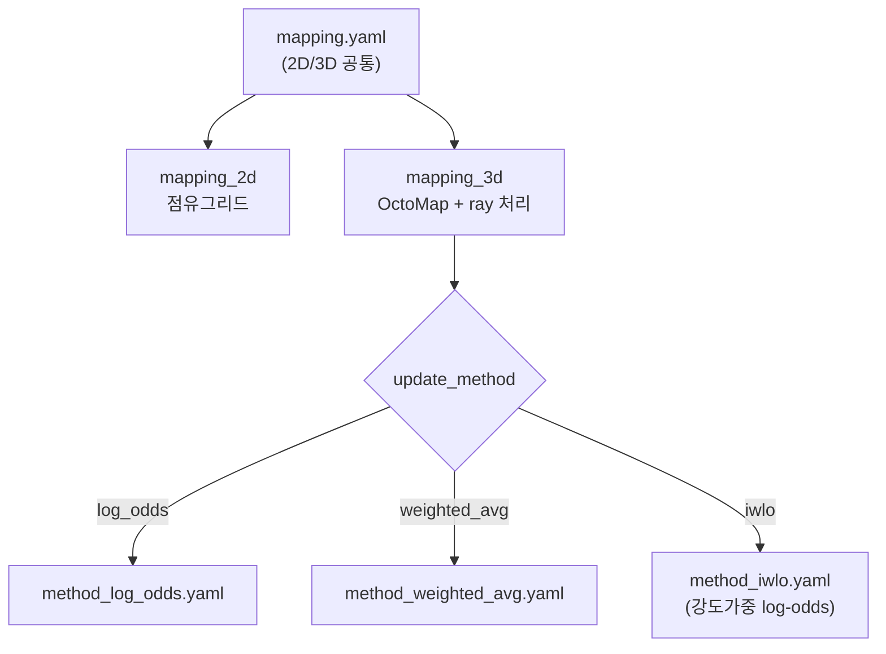

# 매핑(2D·3D) 파라미터

이 페이지는 `mapping.yaml`의 2D 점유그리드·3D OctoMap 파라미터와, IWLO 강도가중 업데이트법 전용 파일인 `mapping/method_iwlo.yaml`의 모든 파라미터를 이름·기본값·정의 위치·의미·수정효과로 정리한 레퍼런스다.

매핑 설정은 두 단계로 나뉜다. `mapping.yaml`은 2D/3D 공통 파라미터(해상도, voxel 크기, ray 처리 옵션 등)를 담고, 업데이트법별 세부 파라미터는 `config/mapping/method_*.yaml`로 분리되어 있다(`mapping.yaml:3`). 현재 기본 업데이트법은 `iwlo`이며(`mapping.yaml:34`), 그 전용 파라미터는 `method_iwlo.yaml`에 정의된다. 전체 파라미터는 `slam.py:44-154`에서 `declare_parameter`로 선언된다.

## 설정 파일 구조

`method_iwlo.yaml`의 log-odds 파라미터는 `mapping.yaml`의 공통 값을 덮어쓴다(`method_iwlo.yaml:7` 주석 "overrides mapping.yaml").

## 2D 매핑 — `mapping.yaml`의 `mapping_2d`

2D 매핑은 소나 극좌표 이미지를 cartesian으로 변환해 world_ned 평면에 누적(overlay)하는 점유그리드다(`mapping_2d.py`). Stonefish sim의 진실 반사율을 그대로 사용한다.

| 파라미터 | 기본값 | 정의 위치 | 의미 | 수정 효과 |
|---|---|---|---|---|
| `map_2d_resolution` | `0.1` | `mapping.yaml:8` | 점유그리드 해상도(meters/pixel) | 작게 하면 더 세밀한 지도지만 같은 영역에 더 많은 픽셀이 필요해 메모리·연산 비용이 커진다 |
| `map_size` | `[4000, 4000]` | `mapping.yaml:9` | `[width, height]` 픽셀 수. `0.1` 해상도에서 400×400m 영역 | 크게 하면 더 넓은 영역을 담지만 메모리가 픽셀 수에 비례해 증가 |
| `map_update_interval` | `1` | `mapping.yaml:10` | N keyframe마다 지도 갱신 | 크게 하면 갱신 빈도가 줄어 연산은 가볍지만 지도 반영이 늦어진다 |
| `intensity_threshold` | `10` | `mapping.yaml:11` | 픽셀로 채택할 최소 intensity(0-255) | 높이면 약한 반사를 걸러 잡음이 줄지만 희미한 구조가 누락될 수 있다 |

!!! tip "해상도와 영역의 트레이드오프"
    `map_2d_resolution`(미터/픽셀)과 `map_size`(픽셀)는 함께 커버 영역을 결정한다. 기본값은 `0.1 m/px × 4000 px = 400 m`로 한 변 400m 영역이다. 더 넓은 영역이 필요하면 `map_size`를 키우고, 더 세밀한 디테일이 필요하면 `map_2d_resolution`을 줄이되, 둘 다 메모리는 픽셀 수에 비례해 늘어난다.

## 3D 매핑 공통 — `mapping.yaml`의 `mapping_3d`

3D 매핑은 OctoMap 확률 격자에 소나 ray를 투영해 점유/자유 공간을 누적한다(`mapping_3d.py` + `ray_processor.cpp` + `octree_mapping.cpp`). ray마다 3D 포인트를 생성하고 범위 bin을 순회하며 DDA traversal로 자유 공간을 비우고, intensity가 있으면 점유로 갱신한다.

| 파라미터 | 기본값 | 정의 위치 | 의미 | 수정 효과 |
|---|---|---|---|---|
| `map_3d_voxel_size` | `0.3` | `mapping.yaml:16` | OctoMap voxel 한 변 크기(meters) | 작게 하면 세밀하지만 voxel 수가 늘어 메모리·연산 비용이 급격히 증가; 크게 하면 거칠지만 가볍다 |
| `min_probability` | `0.7` | `mapping.yaml:17` | 점유 voxel로 판정할 최소 확률 | 높이면 점유 판정이 보수적이 되어 잡음 voxel은 줄지만 약한 점유는 누락 |
| `use_cpp_backend` | `true` | `mapping.yaml:18` | C++ 백엔드(DDA + OpenMP) 사용 | `false`면 순수 Python fallback으로 느려진다 |
| `use_cpp_ray_processor` | `true` | `mapping.yaml:19` | C++ ray processor 백엔드 사용 | `false`면 ray 처리를 Python으로 수행 |
| `use_dda_traversal` | `true` | `mapping.yaml:20` | DDA ray traversal 알고리즘으로 자유 공간 순회 | `false`면 DDA를 사용하지 않는 경로로 전환 |
| `bearing_step` | `4` | `mapping.yaml:21` | N번째 bearing마다 처리(`4` → 512/4=128 bearing) | 작게(예 `1`) 하면 모든 bearing을 처리해 조밀하지만 비용↑; 크게 하면 bearing을 건너뛰어 빠르지만 ray가 성겨진다 |
| `use_range_weighting` | `true` | `mapping.yaml:24` | 지수 범위 가중 사용 | `false`면 거리에 따른 가중 감쇠를 끈다 |
| `lambda_decay` | `0.1` | `mapping.yaml:25` | 범위 가중의 감쇠 계수 | 크게 하면 먼 거리 측정의 가중이 더 빠르게 줄어든다 |
| `enable_propagation` | `true` | `mapping.yaml:28` | bearing 전파(ray 사이 보간) 활성화 | `false`면 ray 사이를 보간하지 않아 빈 틈이 생길 수 있다 |
| `propagation_radius` | `2` | `mapping.yaml:29` | ±2 bearing 전파(±2 → 5 ray 폭) | 크게 하면 더 넓게 전파해 메우지만 번질 수 있다 |
| `propagation_sigma` | `1.5` | `mapping.yaml:30` | 전파 Gaussian 가중치 표준편차 | 크게 하면 전파 가중이 더 완만하게 퍼진다 |
| `enable_gaussian_weighting` | `true` | `mapping.yaml:31` | bearing 기반 갱신에 Gaussian 가중 | `false`면 전파 시 균일 가중을 쓴다 |
| `update_method` | `'iwlo'` | `mapping.yaml:34` | 확률 갱신법 선택. `'log_odds'`, `'weighted_avg'`, `'iwlo'` 중 하나 | 선택값에 따라 대응하는 `method_*.yaml`의 세부 파라미터가 적용된다 |

!!! tip "voxel_size: 정밀도 대 비용"
    `map_3d_voxel_size`를 작게 하면 더 세밀한 3D 지도를 얻지만, voxel 수가 변 길이의 세제곱에 비례해 늘어 메모리와 연산 비용이 급격히 증가한다. 반대로 크게 하면 거칠지만 가볍다. 기본 `0.3`은 정밀도와 비용의 절충값이다.

!!! tip "bearing_step: 밀도 대 속도"
    소나 이미지는 512 bearing(`num_beams`)을 가지며, `bearing_step`은 그중 몇 개를 건너뛸지를 정한다. 기본 `4`는 512/4=128 bearing만 처리해 4배 빠르지만 ray가 성겨진다. `1`로 낮추면 모든 bearing을 처리해 ray가 조밀해지지만 처리량이 4배로 늘어난다. `enable_propagation`(ray 사이 보간)은 `bearing_step`으로 성겨진 ray 사이의 틈을 메우는 역할이라 함께 보아야 한다.

!!! note "C++ 백엔드 미빌드 시 fallback"
    `use_cpp_backend`/`use_cpp_ray_processor`/`use_dda_traversal`는 C++ 확장(`.so`)이 빌드되어 있을 때 가속 경로를 켠다. 확장이 빌드되지 않으면 import 시 순수 Python fallback으로 동작하며 속도가 느려진다.

## IWLO 업데이트법 — `mapping/method_iwlo.yaml`

IWLO(Intensity-Weighted Log-Odds)는 Bayesian log-odds 갱신에 intensity 가중과 관찰 횟수 기반 학습률 감쇠를 결합한 P4 신규 업데이트법이다. 갱신식은 다음과 같다(`method_iwlo.yaml:3`):

\[
L_{\text{new}} = L_{\text{old}} + \Delta L \cdot w(I) \cdot \alpha(n)
\]

여기서 \(w(I)\)는 intensity를 가중으로 바꾸는 sigmoid, \(\alpha(n)\)은 관찰 횟수에 따라 줄어드는 학습률이다. 강한 echo는 \(w(I)\to 1.0\), 첫 관찰은 \(\alpha\to 1.0\)이고 관찰이 많아지면 \(\alpha\to\) `min_alpha`로 수렴한다.

### log-odds 기본 파라미터

이 값들은 `mapping.yaml`의 공통 log-odds 값을 덮어쓴다(`method_iwlo.yaml:7`).

| 파라미터 | 기본값 | 정의 위치 | 의미 | 수정 효과 |
|---|---|---|---|---|
| `log_odds_occupied` | `2.0` | `method_iwlo.yaml:8` | 점유 관찰 시 log-odds 증가량(기본 \(\Delta L\)) | 크게 하면 점유 확신이 더 빠르게 쌓인다 |
| `log_odds_free` | `-6.0` | `method_iwlo.yaml:9` | 자유 관찰 시 log-odds 감소량(강한 clearing) | 더 음수일수록 자유 공간을 더 공격적으로 비운다 |
| `log_odds_max` | `10.0` | `method_iwlo.yaml:10` | log-odds 포화 상한 | 높이면 점유 확률이 더 강하게 굳어 변화에 둔감해진다 |
| `log_odds_min` | `-20.0` | `method_iwlo.yaml:11` | log-odds 포화 하한 | 더 음수일수록 자유 판정이 더 강하게 굳는다 |

### intensity 가중 파라미터

| 파라미터 | 기본값 | 정의 위치 | 의미 | 수정 효과 |
|---|---|---|---|---|
| `intensity_threshold` | `35` | `method_iwlo.yaml:14` | 관찰로 채택할 최소 intensity | 높이면 약한 echo를 더 걸러내 잡음↓, 희미한 구조 누락↑ |
| `intensity_max` | `255.0` | `method_iwlo.yaml:15` | 최대 intensity 값(float). sigmoid 중심 \(I_{mid}=\)`intensity_max`\(/2=127.5\)와 스케일 \(\text{scale}=\)`intensity_max`\(/5=51.0\)을 정한다 | 키우면 sigmoid의 중심과 폭이 함께 커진다 |
| `sharpness` | `0.1` | `method_iwlo.yaml:16` | sigmoid 분모의 기울기 계수. **분모**에 들어가므로 크게 할수록 전이가 완만해진다 | 작게 하면 \(I=127.5\) 주변에서 가중이 급격히 0↔1로 전환되고, 크게 하면 완만하게 변한다 |

가중 함수는 실제 코드(`ray_processor.cpp:429-434`) 기준 다음과 같다.

\[
w(I) = \frac{1}{1 + e^{-x}}, \qquad x = \frac{I - I_{mid}}{\text{sharpness}\cdot\text{scale}}, \qquad I_{mid}=127.5,\ \text{scale}=51.0
\]

즉 sigmoid의 중심은 `intensity_threshold`(35)가 아니라 \(I_{mid}=127.5\)이며, intensity가 127.5보다 크면 \(w(I)>0.5\)로 점유 갱신이 강해지고, 작으면 \(w(I)<0.5\)로 약해진다. `intensity_threshold`(35)는 이 가중과 별개로, 관찰로 채택할지 말지를 거르는 하한이다.

### 학습률 감쇠 파라미터

| 파라미터 | 기본값 | 정의 위치 | 의미 | 수정 효과 |
|---|---|---|---|---|
| `decay_rate` | `0.1` | `method_iwlo.yaml:19` | 관찰 횟수에 따른 학습률 감쇠율 | 크게 하면 관찰이 누적될수록 학습률이 더 빠르게 `min_alpha`로 떨어진다 |
| `min_alpha` | `0.3` | `method_iwlo.yaml:20` | 학습률 하한 | 높이면 오래된 voxel도 새 관찰에 더 민감하게 반응한다 |

학습률은 \(\alpha(n) = \text{min\_alpha} + (1-\text{min\_alpha})\cdot e^{-\text{decay}\cdot n}\)로, 첫 관찰(\(n=0\))에서 \(1.0\), 관찰이 많아지면 `min_alpha`(=`0.3`)로 수렴한다.

### 적응적 갱신 파라미터

| 파라미터 | 기본값 | 정의 위치 | 의미 |
|---|---|---|---|
| `adaptive_update` | `true` | `method_iwlo.yaml:23` | 적응적 갱신 활성화 |
| `adaptive_threshold` | `0.5` | `method_iwlo.yaml:24` | 적응적 갱신 임계값 |
| `adaptive_max_ratio` | `0.3` | `method_iwlo.yaml:25` | 적응적 갱신 최대 비율 |

!!! note "OctoMap 클램프 범위"
    IWLO의 log-odds는 `log_odds_min`(=`-20.0`)과 `log_odds_max`(=`10.0`) 사이로 클램프된다. OctoMap 자체의 voxel 해상도는 `map_3d_voxel_size`(=`0.3`), 점유 판정 최소 확률은 `min_probability`(=`0.7`)를 따른다.

!!! warning "P4a voxel_size 제약"
    `map_3d_voxel_size`는 P4a에서 octree leaf 크기와 일치하도록 수정되었다(이전 leaf 2배 버그 → resolution 일치). voxel 크기를 바꿀 때는 octree leaf와의 정합이 깨지지 않는지 확인이 필요하다.

## C++ ray_processor 기본값과의 차이

`mapping.yaml`/`method_iwlo.yaml`로 전달되지 않을 때 C++ 측이 사용하는 헤더 기본값은 YAML 기본값과 다르다. 운영 시에는 YAML 값이 우선이며, 아래는 미전달 시 C++ 내부 기본값이다(`cpp/ray_processor.h`).

| 항목 | YAML 기본값 | C++ 헤더 기본값 | C++ 정의 위치 |
|---|---|---|---|
| `log_odds_occupied` | `2.0` | `0.5` | `ray_processor.h:69` |
| `log_odds_free` | `-6.0` | `-5.0` | `ray_processor.h:70` |
| `bearing_step` | `4` | `2` | `ray_processor.h:76` |
| `intensity_threshold` | `35` | `30` | `ray_processor.h:77` |
| `update_method` | `'iwlo'` | `0`(LOG_ODDS) | `ray_processor.h:78` |

!!! warning "YAML과 C++ 기본값의 불일치"
    C++ 헤더의 기본값은 YAML이 값을 전달하지 않을 때만 쓰이는 fallback이다. 정상 실행에서는 `mapping.yaml`/`method_iwlo.yaml`의 값이 노드를 통해 전달되어 이 차이는 드러나지 않는다. 다만 C++ 경계 동작을 직접 분석할 때는 두 기본값이 다르다는 점을 유념해야 한다.
