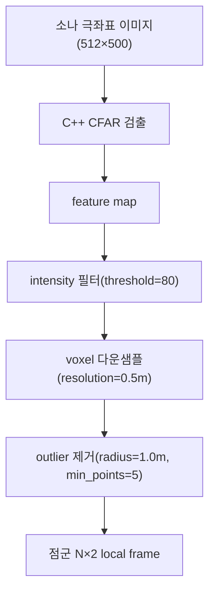

# 소나·피처 파라미터

이 페이지는 FLS(Forward-Looking Sonar) 하드웨어 모델을 정의하는 `sonar.yaml`과 CFAR 기반 피처 추출을 제어하는 `feature.yaml`의 모든 파라미터를 레퍼런스로 정리한다. 각 파라미터의 이름·기본값·타입·정의 위치·의미·수정 시 효과를 표로 제공하고, CFAR 튜닝 가이드를 admonition으로 덧붙인다.

## 개요

소나 파이프라인은 극좌표 소나 이미지(512×500)를 입력받아 CFAR(Constant False Alarm Rate) 검출로 강한 반사 셀을 골라내고, intensity 필터·다운샘플·outlier 제거를 거쳐 점군(point cloud)을 생성한다. `sonar.yaml`은 이 입력 이미지의 기하·하드웨어 사양을, `feature.yaml`은 그 위에서 동작하는 검출·후처리 파라미터를 담당한다.

## sonar.yaml — FLS 하드웨어

소나 센서의 기하학적 사양과 차체 장착 정보를 정의한다. `num_beams`는 소나 이미지의 가로 폭(beam 수), `num_bins`는 세로 높이(range bin 수)에 대응한다(feature.yaml과 함께 slam.py:44-154에서 `declare_parameter`로 선언).

| 이름 | 기본값 | 타입 | 정의 | 의미 | 수정 효과 |
|---|---|---|---|---|---|
| `vehicle_name` | `'bluerov2'` | string | sonar.yaml | 토픽 네임스페이스에 쓰이는 차량 이름 | 다른 차량(예: `x500`) 사용 시 토픽 경로 `/{v}/...`가 그에 맞춰 바뀜 |
| `horizontal_fov` | `130.0` | float (deg) | sonar.yaml | 소나의 수평 시야각 | 극좌표→직교 변환 시 beam 방향 범위를 결정. 키우면 좌우 커버리지 확대, 좁히면 집중 |
| `vertical_fov` | `20.0` | float (deg) | sonar.yaml | 소나의 수직 시야각(elevation) | 3D 매핑에서 ray의 수직 퍼짐 범위를 결정 |
| `num_beams` | `512` | int | sonar.yaml | beam 수 = 소나 이미지 가로 폭(width) | 각도 분해능. 입력 이미지 폭과 일치해야 하며, bearing 방향 샘플 수를 좌우 |
| `num_bins` | `500` | int | sonar.yaml | range bin 수 = 소나 이미지 세로 높이(height) | 거리 분해능. 입력 이미지 높이와 일치해야 함 |
| `range_min` | `0.5` | float (m) | sonar.yaml | 측정 최소 거리 | 이보다 가까운 반사는 무시. 키우면 근거리 노이즈 차단, 줄이면 근접 물체 감지 |
| `range_max` | `40.0` | float (m) | sonar.yaml | 측정 최대 거리 | 이미지 세로축의 최대 거리. range bin당 거리 해상도 = `range_max / num_bins` |
| `sonar_position` | `[0, 0, 0]` | float[3] (m) | sonar.yaml | base_link FRD 기준 소나 장착 위치 | 점군을 차체 프레임으로 변환할 때의 오프셋. 실제 장착 위치와 맞춰야 정합 |
| `sonar_tilt_deg` | `30.0` | float (deg) | sonar.yaml | 소나가 아래로 향하는 틸트 각 | 극좌표→world_ned 변환 시 반영(2D 매핑의 cartesian 재정렬에 사용). 해저 스캔 각도 결정 |

!!! note "이미지 차원과의 정합"
    `num_beams`(512)는 입력 소나 이미지의 width, `num_bins`(500)는 height에 정확히 대응한다. 이 값들이 실제 발행되는 `/{v}/fls/image`의 해상도와 어긋나면 극좌표 해석이 틀어지므로, 시뮬레이터/하드웨어의 이미지 크기와 반드시 일치시켜야 한다. range bin당 거리 해상도는 \( \text{range\_max} / \text{num\_bins} = 40.0 / 500 = 0.08\,\text{m} \)이다.

## feature.yaml — CFAR 피처 추출

CFAR 검출 파라미터(`CFAR.*`)와 검출 후 점군 후처리 파라미터(`filter.*`), 그리고 시각화 설정(`visualization.*`)으로 나뉜다. CFAR는 셀별 주변 잡음 수준을 추정해 적응형 임계값을 만들고, 그 임계값을 넘는 셀만 표적(target)으로 검출한다.

### CFAR 검출 파라미터

| 이름 | 기본값 | 타입 | 정의 | 의미 | 수정 효과 |
|---|---|---|---|---|---|
| `CFAR.Ntc` | `20` | int | feature.yaml | 훈련 셀(training cell) 수 — 주변 잡음 추정에 쓰는 셀 | 키우면 잡음 추정이 안정되어 strong target만 통과(엄격), 줄이면 더 민감 |
| `CFAR.Ngc` | `10` | int | feature.yaml | 가드 셀(guard cell) 수 — CUT 주변 제외 셀 | 표적 에너지가 훈련 셀로 새는 것을 차단. 키우면 큰 표적 누설 방지 |
| `CFAR.Pfa` | `0.01` | float | feature.yaml | 오경보율(probability of false alarm) = 1% | 낮추면 임계값이 높아져 검출이 엄격(오검출↓), 높이면 검출이 느슨(오검출↑) |
| `CFAR.rank` | `10` | int | feature.yaml | OS(order statistic) 알고리즘에서 사용하는 순위 | 정렬된 훈련 셀 중 rank번째 값을 잡음 추정으로 사용(`alg='OS'`일 때만 의미) |
| `CFAR.alg` | `'SOCA'` | string | feature.yaml | CFAR 변형 알고리즘 선택 | `CA`/`SOCA`/`GOCA`/`OS` 중 선택. `SOCA`가 robust로 추천됨 |

`alg`로 선택 가능한 네 가지 변형은 잡음 수준을 추정하는 방식이 다르다. CA(Cell Averaging)는 훈련 셀 전체 평균, SOCA(Smallest Of Cell Averaging)는 양쪽 절반 중 작은 평균(robust, 추천), GOCA(Greatest Of Cell Averaging)는 큰 평균, OS(Order Statistic)는 정렬 후 `rank`번째 값을 사용한다.

### filter — 점군 후처리 파라미터

| 이름 | 기본값 | 타입 | 정의 | 의미 | 수정 효과 |
|---|---|---|---|---|---|
| `filter.threshold` | `80` | int (0–255) | feature.yaml | CFAR 통과 후 최소 intensity 임계 | 키우면 약한 반사 제거(검출↓), 줄이면 약한 반사도 유지(노이즈↑) |
| `filter.resolution` | `0.5` | float (m) | feature.yaml | voxel 다운샘플 해상도 | 키우면 점군 희소화(연산↓, 디테일↓), 줄이면 조밀(연산↑) |
| `filter.radius` | `1.0` | float (m) | feature.yaml | outlier 제거 반경 | 이 반경 내 이웃 수로 outlier 판정. 키우면 더 관대 |
| `filter.min_points` | `5` | int | feature.yaml | outlier 판정용 최소 이웃 점 수 | `radius` 내 이웃이 이보다 적으면 제거. 키우면 고립점 적극 제거 |
| `filter.skip` | `5` | int | feature.yaml | 매 N번째 프레임만 처리 | 키우면 처리 빈도↓(연산 부하↓), 줄이면 매 프레임 처리(부하↑) |

### visualization — 시각화 설정

| 이름 | 기본값 | 타입 | 정의 | 의미 | 수정 효과 |
|---|---|---|---|---|---|
| `visualization.coordinates` | `'cartesian'` | string | feature.yaml | 피처 시각화 좌표계 | `cartesian`/극좌표 선택. 표시 방식만 영향, 검출 로직과 무관 |
| `visualization.radius` | `2.0` | float | feature.yaml | 시각화 마커 반경 | 키우면 마커가 크게 표시 |
| `visualization.color` | `'green'` | string | feature.yaml | 시각화 마커 색 | RViz 등에서 피처 점군 표시 색 |

## CFAR 튜닝 가이드

!!! tip "엄격(strong target만) vs 민감(약한 표적도) 조절"
    CFAR는 두 축으로 검출 엄격도를 조절한다.

    - **`Ntc`(훈련 셀)를 키우면** 주변 잡음 추정이 더 안정적이고 보수적이 되어, 임계값이 높게 형성되고 **strong target만** 통과한다. 줄이면 국소적 변화에 민감해져 약한 표적도 잡지만 오검출이 늘 수 있다.
    - **`Pfa`(오경보율)를 낮추면** 허용 오경보가 줄어 임계값이 높아지므로 **검출이 엄격**해진다(오검출↓, 누락↑). 높이면 느슨해진다(검출↑, 오검출↑).

    잡음이 많은 환경에서는 `Ntc`를 키우고 `Pfa`를 낮춰 strong target 위주로 검출하고, 약한 표적까지 놓치지 않아야 하면 반대로 조절한다. `alg`는 클러터 경계에서 robust한 `SOCA`가 기본 추천이다.

!!! warning "후처리 임계와의 상호작용"
    CFAR가 검출한 셀은 다시 `filter.threshold`(기본 `80`, 0–255)의 intensity 컷을 통과해야 점군에 남는다. CFAR를 민감하게(`Pfa` 높게) 풀어도 `filter.threshold`가 높으면 약한 검출은 후처리에서 걸러진다. 두 단계의 임계를 함께 고려해 검출 밀도를 맞춰야 한다. 또한 `filter.skip`(기본 `5`)은 매 N번째 프레임만 처리하므로, 키우면 실시간 부하는 줄지만 피처 갱신 빈도도 함께 떨어진다.

## 관련 페이지

- 검출 후 점군은 ICP 스캔 매칭과 OctoMap 매핑으로 흐른다. 키프레임·노이즈·매핑 파라미터는 별도 페이지를 참조한다.
