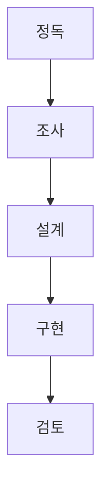

# 버전·상태

이 페이지는 `stonefish_slam`의 현재 버전(0.4.0), CHANGELOG 이력, v0.4.0에서 바뀐 내용, P4_FLAGS의 해결·잔여 항목, 그리고 코드베이스가 따르는 핵심 규약(CONVENTIONS)과 솔직한 잔여 제약을 정리한다.

## 현재 버전 한눈에

| 항목 | 값 |
|-----|-----|
| 버전 | `0.4.0` |
| 날짜 | 2026-06-24 |
| 라이선스 | GPL-3.0 |
| 빌드 시스템 | `ament_cmake` (C++ pybind11 확장 때문에 `setup.py` 없음) |
| 메인테이너 | Seungmin Kim <luckkim123@gmail.com> |
| 브랜치 | `p4-algorithmic` (main merge 대기) |
| 테스트 | clean env에서 `37 passed`, `0 xfail` |

`0.4.0`은 minor 버전 bump이며, 이는 **의도적인 동작 변경**(알고리즘 정확성 수정)을 포함한다는 신호다. P3 단계의 재구조화는 동작을 보존하는 것이 목표였지만, P4 단계는 버그를 고치면서 출력이 의도적으로 달라진다.

## CHANGELOG 이력

| 버전 | 날짜 | 성격 |
|-----|------|------|
| `0.1.0` | 2025-10-01 | 기본 SLAM |
| `0.3.0` | 2025-11-30 | C++ 백엔드 OctoMap 도입 |
| `0.3.1` | 2026-06-24 | P3 재구조화(동작 보존) |
| `0.4.0` | 2026-06-24 | P4 알고리즘 정확성(의도적 동작 변경) |

!!! note "0.3.1과 0.4.0이 같은 날짜인 이유"
    `0.3.1`은 패키지 구조를 재정비하면서도 출력 동작을 그대로 유지한 릴리스이고, `0.4.0`은 그 위에서 알고리즘 버그를 고친 릴리스다. 같은 작업 일정 안에서 "구조 정리 → 동작 수정" 순서로 분리해 커밋했기 때문에 날짜가 겹친다.

## v0.4.0 변경 내용

P4 단계는 제거·수정·변경·리팩토링의 네 축으로 나뉜다.

### 제거

`kalman_node`를 일괄 제거했다. 이 노드는 부재 패키지의 `uuv` import 때문에 crash했고, launch 파일에서의 참조가 0건이었으며, 내부적으로 `H=0`이라 사실상 아무 기능도 하지 않았다.

### 수정 (버그 픽스)

| 대상 | 변경 전 | 변경 후 |
|-----|---------|---------|
| octree leaf 크기 | `resolution × 2` | `resolution + 1e-9` |
| DDA traversal 위치 | corner 기준 | center 기준 |
| Python ICP fallback outlier ratio | `0.8` | `1.0` (perfect overlap 복원) |
| dead_reckoning 압력→깊이 | 1000배 오차 식 | 정답식 \( h = (P - 101325) / (1025 \cdot 9.80665) \) |

### 변경 (동작 변경)

robust Cauchy + PCM 도입(공분산 연산을 `np.inv` 대신 `solve`로), `frame_id`를 `world_ned`로 8+1곳 통일, C++ 확장 누락 시 silent 동작을 warning으로 변경했다.

### 리팩토링 (god-method 분해)

| 메서드 | 변경 전 | 변경 후 |
|-------|---------|---------|
| `process_sonar_ray` | 274줄 | 29줄 + 헬퍼 3개 |
| `process_sonar_image` | 240줄 | 75줄 + 헬퍼 3개 |

이 분해는 동작을 보존하는 것을 전제로 했으며, characterization 테스트로 출력 동등성을 확인했다.

### 검증

clean env(`env -i`)에서 `37 passed`, `0 xfail`. P4 시작 시점의 `13 passed + 1 xfail`에서 출발해 TDD/characterization 테스트와 code-reviewer를 거쳐 37건으로 늘었다.

## P4_FLAGS 상태

P4 작업은 `P4_FLAGS.md`에 항목별 플래그로 추적된다. 측정으로 가설을 반박한 경우가 여럿 있다(예: ICP의 float32 정밀도 가설은 실제로는 outlier_ratio 문제로 판명).

### 해결됨

| 플래그 | 항목 | 비고 |
|-------|------|------|
| P4a | 압력→깊이 1000배 버그 | depth 정답식으로 수정(아래 P4b 설명과 동일 영역) |
| P4a | ICP float32 가설 반박 | 실제 원인은 outlier_ratio |
| P4a | octree leaf 2× | `resolution + 1e-9`로 수정 |
| P4a | DDA corner bias | center 기준으로 수정 |
| P4a | kalman 제거 | 부재 패키지 import crash 해소 |
| P4b | 압력→깊이 정답식 | dead_reckoning depth 식 |
| P4c | robust Cauchy | NSSM 루프클로저 factor에 적용 |
| P4d | frame_id world_ned | 출력 frame 통일 |
| P4e | god-method 분해 | `process_sonar_ray`·`process_sonar_image` |
| — | 노드명 충돌 반증 | namespace 분리로 충돌 아님을 확인 |

### 잔여

아직 닫지 않은 항목들이다.

| 항목 | 상태 |
|-----|------|
| `polar_to_cartesian` 통합 | 미통합 |
| PascalCase 파라미터 | 정리 미완 |
| `__all__` 추가 | 미적용 |
| free-region 반전 | live-sim 검증 필요 |
| fusion `observation_count` | 의도 검증 필요 |

!!! warning "잔여 제약은 솔직히"
    위 잔여 항목은 "동작은 하지만 아직 정리·검증이 끝나지 않은" 상태다. 특히 free-region 반전은 live-sim 없이는 확정할 수 없고, fusion의 `observation_count`는 그 설계 의도 자체가 아직 검증 대상이다. 이 두 항목은 코드가 돈다고 해서 정답이라는 보장이 없는 영역이므로, 결과를 해석할 때 주의해야 한다.

## CONVENTIONS 핵심

코드베이스의 단일 진실 원천(SSOT)은 `docs/CONVENTIONS.md`다. 핵심 규약은 다음과 같다.

위 5단계는 작업 진입 게이트다. 더불어 코드 레벨에서 강제되는 규약은 아래와 같다.

| 규약 | 내용 |
|-----|------|
| 절대 import | relative import 금지, inter-package import도 절대 경로 |
| frame_id 정책 | 전역은 `world_ned`(NED), 로컬 `odom→base_link` 체인은 ENU(REP-105) |
| C++ fallback | pybind11 확장 변경 시 순수 Python fallback과 반드시 동기화 |
| 정적 게이트 | wildcard import 0건, AST 게이트로 검사 |

### C++ fallback 동기화

C++ 확장(`cfar`, `dda_traversal`, `octree_mapping`, `ray_processor`, `pcl_module`)이 빌드되지 않은 환경에서도 순수 Python fallback이 동작한다(특히 `pcl.py`의 ICP). 따라서 C++ 경계의 동작을 바꾸면 fallback도 함께 바꿔야 결과가 일관된다(CONVENTIONS §2.9).

### AST 게이트

`test/static_import_gate.py`와 `test/test_wildcard_gate.py`가 import 규약을 AST 수준에서 검사한다. wildcard import는 0건이어야 하며, relative import는 게이트에서 차단된다. 이 게이트는 `rclpy`가 없는 환경에서도 정적 분석으로 규약 위반을 잡아낸다.

!!! tip "프레임·규약 더 보기"
    좌표계와 TF 정책의 자세한 내용은 [좌표계와 TF](architecture/frames.md)를, 알고리즘 전반은 [SLAM 파이프라인](methodology/index.md)을, 파라미터 기본값은 [파라미터 개요](parameters/index.md)를 참고하라.

## 솔직한 잔여 제약

마지막으로, 이 릴리스가 "완성"이라는 의미가 아님을 분명히 한다.

- **`icp_config` 절대경로 하드코딩**은 여전히 남아 있어 launch 오버라이드로 우회한다(P4 flag).
- **PascalCase 파라미터**와 **`__all__` 누락**은 코드 위생 항목으로 아직 정리되지 않았다.
- **free-region 반전**과 **fusion `observation_count`**는 정적 검토만으로는 확정할 수 없어 live-sim 검증을 남겨두었다.
- 브랜치는 `p4-algorithmic`이며 **main merge 전**이다. main 기준 동작은 아직 `0.3.1` 계열일 수 있으므로, `0.4.0`의 동작 변경을 기대하려면 이 브랜치를 확인해야 한다.
